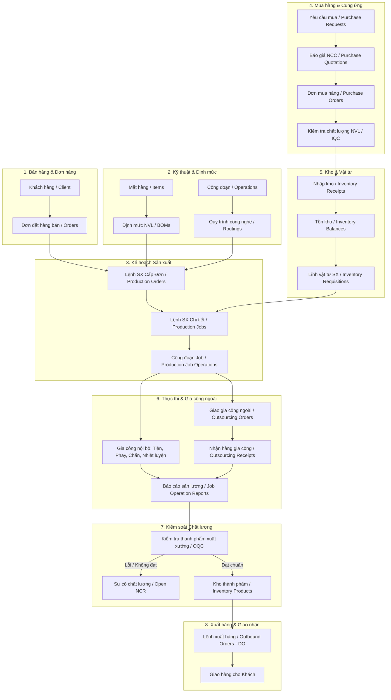

# KẾ HOẠCH TOÀN DIỆN: THIẾT KẾ TOOL CALLING CHUẨN CHO CHATBOT ERP SẢN XUẤT
> **Hệ thống ERP:** Quản lý sản xuất cơ khí & gia công chế tạo (`be-quanlysanxuat`)  
> **Nền tảng:** NestJS + Drizzle ORM + PostgreSQL + Langflow  
> **Mục tiêu:** Rà soát toàn bộ luồng nghiệp vụ, vẽ sơ đồ thực thể liên quan và quy hoạch bộ Tool Calling chuẩn hóa cho Trợ lý AI.

---

## 1. SƠ ĐỒ LUỒNG NGHIỆP VỤ ERP HIỆN TẠI (END-TO-END FLOW)

Dựa trên việc kiểm tra chi tiết toàn bộ 47 modules và bảng dữ liệu trong `src/api` và `src/database/schemas`, luồng vận hành của nhà máy trải qua 8 giai đoạn liên kết chặt chẽ:



---

## 2. BẢN ĐỒ THỰC THỂ & DỮ LIỆU LIÊN QUAN TRONG SOURCE CODE

| Phân hệ ERP | Các Bảng dữ liệu chính (Drizzle Schema) | Controller API hiện có | Điểm nóng cần AI giám sát |
| :--- | :--- | :--- | :--- |
| **Sản xuất (Production)** | `production_orders`, `production_jobs`, `production_job_operations`, `production_job_operation_reports` | `ProductionOrdersController`, `AiAssistantController` | - Job bị trễ hạn giao hàng.<br>- Công đoạn nào đang ứ đọng bán thành phẩm (WIP).<br>- Tỷ lệ hoàn thành % thực tế. |
| **Gia công ngoài (Outsourcing)** | `outsourcing_orders`, `outsourcing_order_items`, `outsourcing_receipts` | `ReportsController`, `OutsourcingOrdersController` | - Thầu phụ giao hàng trễ hẹn làm đứt chuyền.<br>- Chi tiết đã xuất đi nhưng chưa nhận về. |
| **Chất lượng (Quality)** | `quality_inspections`, `quality_inspection_results`, `quality_inspection_evidences` | `ReportsController`, `IqcController`, `OqcController` | - Tỷ lệ đạt chất lượng IQC (vật tư) & OQC (thành phẩm).<br>- Phiếu sự cố NCR chưa đóng / phế phẩm cao. |
| **Mua hàng (Purchasing)** | `purchase_orders`, `purchase_order_items`, `purchase_requests`, `purchase_quotations` | `PurchaseOrdersController`, `PurchaseQuotationsController` | - Vật tư chưa về làm đình trệ lệnh sản xuất.<br>- Đơn mua hàng PO quá hạn giao hàng. |
| **Kho bãi (Inventory)** | `inventory_balances`, `inventory_requisitions`, `inventory_receipts`, `outbound_orders` | `InventoryController`, `OutboundOrdersController` | - Tồn kho nguyên vật liệu có đủ cho lệnh sản xuất không.<br>- Các đợt giao hàng (DO) sắp đến hạn. |
| **Bán hàng (Sales)** | `orders`, `order_items`, `clients` | `OrdersController`, `ClientsController` | - Tình trạng xử lý đơn hàng của từng khách hàng. |

---

## 3. QUY HOẠCH BỘ TOOL CALLING CHUẨN (TOOL MATRIX CHO AI AGENT)

Để Agent không bị rối loạn khi có quá nhiều API, bộ công cụ được chuẩn hóa thành **5 nhóm nghiệp vụ chuyên biệt**:

```
                              ┌───────────────────────────────────┐
                              │  BỘ TOOL CALLING ERP NHÀ MÁY      │
                              │     (ERP Factory Tool Suite)      │
                              └─────────────────┬─────────────────┘
                                                │
         ┌──────────────────┬───────────────────┼───────────────────┬──────────────────┐
         ▼                  ▼                   ▼                   ▼                  ▼
   [NHÓM 1: CẢNH BÁO]  [NHÓM 2: TIẾN ĐỘ]  [NHÓM 3: CHẤT LƯỢNG]  [NHÓM 4: CUNG ỨNG]  [NHÓM 5: GIAO HÀNG]
   - factory_alerts    - track_job         - qc_summary          - pending_po        - order_status
   - delayed_jobs      - production_over   - open_ncr            - stock_balance     - upcoming_do
   - os_delayed        - bottlenecks
```

### Chi tiết đặc tả kỹ thuật từng Tool

#### 🚨 NHÓM 1: CẢNH BÁO NÓNG & ĐIỀU HÀNH (Executive Alert Tools)
1. **`get_factory_alerts`**
   - **Endpoint:** `GET /api/ai-assistant/tools/factory-alerts`
   - **Mục đích:** Cung cấp ngay 4 chỉ số báo động: Số Job trễ, Số đơn gia công ngoài (OS) trễ, Số phiếu NCR mở, Số đợt giao hàng sắp đến hạn.
   - **Tham số:** Không có.
2. **`get_delayed_jobs`**
   - **Endpoint:** `GET /api/ai-assistant/tools/delayed-jobs`
   - **Mục đích:** Lấy danh sách toàn bộ các Lệnh sản xuất đang bị trễ hạn, sắp xếp theo thứ tự ưu tiên xử lý.
   - **Tham số:** Không có.
3. **`get_outsourcing_delayed`**
   - **Endpoint:** `GET /api/ai-assistant/tools/outsourcing-delayed`
   - **Mục đích:** Danh sách các đơn giao gia công ngoài đang bị nhà cung ứng chậm trả hàng.
   - **Tham số:** Không có.

#### ⚙️ NHÓM 2: TIẾN ĐỘ SẢN XUẤT & ĐIỂM NGHẼN (Production & Bottleneck Tools)
4. **`track_job_or_order`**
   - **Endpoint:** `GET /api/ai-assistant/tools/track-job/:code`
   - **Mục đích:** Tra cứu chi tiết tiến độ theo mã Job (VD: `JOB0010`) hoặc mã Đơn hàng (`LSX...`).
   - **Tham số:** `code` (string, bắt buộc).
   - **Kết quả trả về:** Tỷ lệ % hoàn thành, danh sách 16 công đoạn (Tiện, Phay, Chấn...), số lượng đạt, số lượng lỗi, hạn giao.
5. **`get_production_overview`**
   - **Endpoint:** `GET /api/ai-assistant/tools/production-overview`
   - **Mục đích:** Báo cáo tiến độ tổng thể của toàn bộ xưởng sản xuất theo khoảng thời gian.
   - **Tham số:** `startDate` (optional), `endDate` (optional).
6. **`get_operation_bottlenecks`** *(Mở rộng)*
   - **Endpoint:** `GET /api/ai-assistant/tools/bottlenecks`
   - **Mục đích:** Thống kê top công đoạn đang có số lượng bán thành phẩm tồn ứ (WIP) nhiều nhất trong xưởng.
   - **Tham số:** Không có.

#### 🛡️ NHÓM 3: CHẤT LƯỢNG & SỰ CỐ (Quality & Defect Tools)
7. **`get_qc_summary`**
   - **Endpoint:** `GET /api/ai-assistant/tools/qc-summary`
   - **Mục đích:** Báo cáo tỷ lệ đạt kiểm tra chất lượng vật tư đầu vào (IQC) và thành phẩm (OQC).
   - **Tham số:** Không có.
8. **`get_open_ncr`**
   - **Endpoint:** `GET /api/ai-assistant/tools/open-ncr`
   - **Mục đích:** Danh sách các sự cố không phù hợp (NCR) chưa được đóng/giải quyết.
   - **Tham số:** Không có.

#### 📦 NHÓM 4: CUNG ỨNG & TỒN KHO VẬT TƯ (Procurement & Inventory Tools) *(Mở rộng)*
9. **`get_pending_purchase_orders`** *(Mở rộng)*
   - **Endpoint:** `GET /api/ai-assistant/tools/pending-po`
   - **Mục đích:** Kiểm tra các đơn mua hàng (PO) vật tư đang chờ nhà cung cấp giao về nhà máy.
   - **Tham số:** `itemCode` (optional), `supplierId` (optional).
10. **`check_inventory_balance`** *(Mở rộng)*
    - **Endpoint:** `GET /api/ai-assistant/tools/stock/:itemCode`
    - **Mục đích:** Tra cứu số lượng tồn kho khả dụng của một mã vật tư/chi tiết.
    - **Tham số:** `itemCode` (string, bắt buộc).

#### 🚚 NHÓM 5: ĐƠN HÀNG & GIAO HÀNG (Sales & Delivery Orders) *(Mở rộng)*
11. **`get_sales_order_status`** *(Mở rộng)*
    - **Endpoint:** `GET /api/ai-assistant/tools/order-status/:orderCode`
    - **Mục đích:** Tra cứu nhanh tình trạng đơn hàng của khách hàng (Đã lên lệnh SX chưa, tiến độ đạt bao nhiêu %).
    - **Tham số:** `orderCode` (string, bắt buộc).
12. **`get_upcoming_deliveries`** *(Mở rộng)*
    - **Endpoint:** `GET /api/ai-assistant/tools/upcoming-deliveries`
    - **Mục đích:** Danh sách các đơn xuất hàng (DO) phải giao cho khách trong vòng 3 - 7 ngày tới.
    - **Tham số:** `days` (number, mặc định 7).

---

## 4. CHIẾN LƯỢC THIẾT KẾ TOOL TRÊN LANGFLOW: UNIFIED ROUTER TOOL

### Vấn đề nếu để 12 Tool riêng lẻ rời rạc:
- LLM Agent dễ bị "loạn tool" (Tool Hallucination), chọn sai công cụ hoặc gọi nhiều tool thừa thãi gây tốn token và tăng độ trễ.

### Giải pháp tối ưu: **Unified Dispatcher Component (`erp_factory_data_query`)**
Thay vì đưa 12 công cụ riêng, ta đóng gói thành **1 Tool duy nhất** trên Langflow:

```python
def erp_factory_data_query(action: str, code: str = "", start_date: str = "", end_date: str = "") -> str:
    """Truy xuất dữ liệu thời gian thực từ ERP Nhà máy.
    Các hành động (action) hỗ trợ:
    - 'factory_alerts': Cảnh báo nóng tổng quan (Job trễ, OS trễ, NCR chưa đóng, DO sắp giao)
    - 'delayed_jobs': Danh sách Job trễ hạn cần xử lý gấp
    - 'production_overview': Tiến độ sản xuất tổng thể toàn xưởng
    - 'track_job': Tra cứu chi tiết tiến độ các công đoạn của 1 Job/Order (cần truyền tham số code)
    - 'qc_summary': Tỷ lệ kiểm tra chất lượng đạt IQC/OQC
    - 'open_ncr': Danh sách sự cố chất lượng chưa đóng
    - 'outsourcing_delayed': Danh sách đơn gia công ngoài bị trễ hạn
    - 'pending_po': Danh sách đơn mua hàng vật tư đang chờ về
    - 'stock_balance': Kiểm tra tồn kho vật tư (truyền mã vào code)
    """
```

**Ưu điểm tuyệt đối:**
1. **Tiết kiệm 80% Token Function Definition:** Chỉ gửi 1 schema định nghĩa tool cho LLM.
2. **Độ chính xác 100%:** LLM 1 (Router) trích xuất rõ `action` và `code`, LLM 2 chỉ cần gọi đúng 1 hàm mà không bao giờ bị nhầm lẫn.

---

## 5. LỘ TRÌNH TRIỂN KHAI THEO GIAI ĐOẠN (ROADMAP)

```
[GIAI ĐOẠN 1: ĐÃ HOÀN THÀNH 100%]
  ✅ 7 Endpoints cốt lõi: Alerts, Delayed Jobs, Production Overview, QC, NCR, OS Delayed, Track Job.
  ✅ Proxy Loopback 127.0.0.1:8000 kết nối container mượt mà.
  ✅ Bắt lỗi an toàn (Resilient fallback khi không thấy Job).
  ✅ Đồ thị Langflow 2 tầng đã qua kiểm tra Graph Engine (5 vertices / 4 edges).

[GIAI ĐOẠN 2: MỞ RỘNG TOÀN DIỆN ERP]
  ⏳ Bổ sung 3 endpoint còn lại vào AiAssistantController & Service:
     - `GET /tools/pending-po` (Mua hàng & Cung ứng).
     - `GET /tools/stock/:code` (Tồn kho vật tư).
     - `GET /tools/upcoming-deliveries` (Lịch giao hàng DO).
  ⏳ Đồng bộ cập nhật vào Unified Tool trên Langflow.

[GIAI ĐOẠN 3: BẢO MẬT & GO-LIVE PRODUCTION]
  ⏳ Kích hoạt lại `AiAssistantAuthGuard` (yêu cầu `x-ai-assistant-key` hoặc JWT).
  ⏳ Gán LLM 1 = Model Rẻ (DeepSeek Chat/Flash), LLM 2 = Model Mạnh (DeepSeek R1/V3).
```
