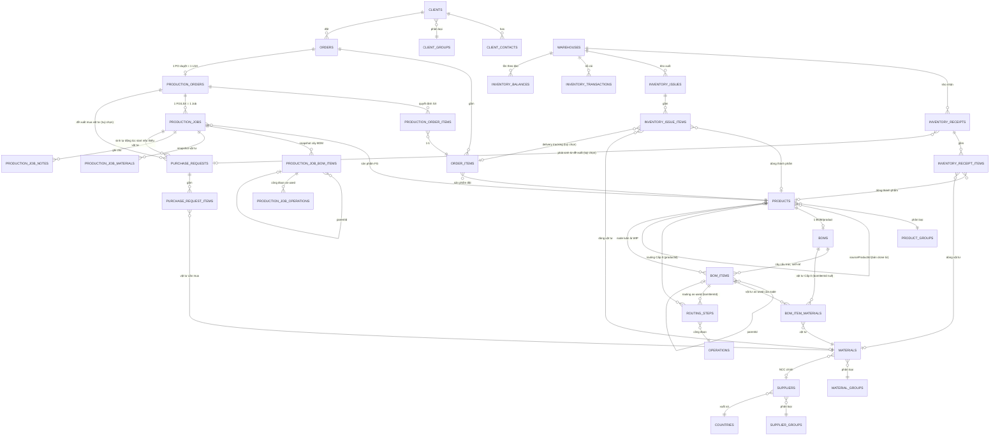

# Kiến trúc miền dữ liệu

Bản đồ xuyên suốt các bảng chính và cách chúng nối với nhau — khác `docs/domains/<x>.md` (business
rules + API contract của từng module), file này chỉ trả lời "cái gì trỏ vào cái gì" và "ghi theo thứ
tự nào khi một thao tác chạm nhiều module". Đọc trước khi sửa bất kỳ luồng nào chạm ≥ 2 module.

## Sơ đồ ER theo cụm

Master data (`client-groups`, `supplier-groups`, `material-groups`, `product-groups`, `countries`,
`departments`, `positions`, `units`, `operations`) chỉ được tham chiếu, không tham chiếu ngược — bỏ
khỏi sơ đồ trên cho gọn, xem `docs/domains/partners.md`.

## Thứ tự ghi của các luồng bắc cầu nhiều module

**Tạo sản phẩm** (`ProductsService.createProduct`): một `INSERT` đơn vào `products`, không cần
transaction. **`boms`/`bom_items` KHÔNG được tạo ở bước này** — BOM sinh ra lười (get-or-create)
ngay trong transaction ghi node/vật tư/công đoạn đầu tiên, qua
`POST /products/:productId/bom/items` hoặc `.../bom/materials` hoặc `.../operations`. `bom_item_materials`
viết riêng qua `.../bom/materials` (Cấp 0) hoặc `.../bom/items/:itemId/materials` (as-used);
`routing_steps` viết riêng theo từng node qua `/products/:productId/bom/items/:itemId/operations*` —
cùng khuôn mount kép. `POST /products/:id/copy` đọc trước toàn bộ (cây BOM, vật tư as-used, routing
Cấp 0 + as-used) rồi ghi lại tất cả — kể cả header `boms` — trong một transaction, ghi
`sourceProductId` vào bản clone. Chi tiết từng bước: `docs/workflows/product-setup.md`.

**Duyệt đơn hàng** (`OrdersService.approveOrder`, chỉ hợp lệ từ `PENDING_CONFIRMATION` — `E074` nếu
không, `DRAFT` chưa gửi duyệt thì chưa duyệt được): đọc `InventoryService.getStockLevels` (chỉ đọc,
chạy trước transaction) → trong transaction: update `orders.status = AWAITING_PRODUCTION` →
`ProductionOrdersService.seedPlan` tạo `production_orders` (header, `PENDING`) +
`production_order_items` (1-1 với `order_items`, Đề xuất SX = onHand − reserved, trừ demand của
chính PO này). Chi tiết từng bước: `docs/workflows/order-approval.md`.

**Duyệt LSX** (`ProductionOrdersService.approveProductionOrder`, `PENDING` → `APPROVED`): đọc
`production_order_items`, gộp SL theo `productId` (chỉ giữ SL > 0) → trong transaction: sinh mã
`LSXxxxx`, update `production_orders.status` → update `orders.status = IN_PROGRESS` →
`ProductionJobsService.createJobs` tạo 1 `production_jobs` row/sản phẩm, rồi nhân bản cây BOM sang
`production_job_bom_items`, copy routing as-used của từng node sang `production_job_operations`, và
BOM (gộp theo vật tư × SL Job) sang `production_job_materials` — cùng trong transaction này.

**Post/cancel phiếu kho** (`InventoryReceiptsService.postInventoryReceipt`/`InventoryIssuesService.postInventoryIssue`,
chỉ hợp lệ từ `DRAFT`): validate kho + dòng phiếu (đọc, ngoài transaction) → trong transaction, gọi
`InventoryPostingService.postDocument` — khoá từng dòng `inventory_balances` liên quan bằng
`SELECT … FOR UPDATE`, cộng/trừ theo dấu bút toán, ghi `inventory_transactions`, rồi update
`status` phiếu. `cancel` từ `POSTED` gọi `InventoryPostingService.reverseDocument` cùng khuôn, ghi
bút toán đảo dấu thay vì xoá. Chi tiết: `docs/workflows/stock-movement.md`.

**Start Job** (`ProductionJobsService.startJob`, chỉ hợp lệ từ `PENDING`): đọc
`production_job_materials` + `InventoryService.getMaterialStockLevels` (chỉ đọc, chạy trước
transaction) để tính vật tư thiếu → trong transaction: update `production_jobs.status =
IN_PROGRESS` → nếu có thiếu, `PurchaseRequestsService.createShortageRequest` ghi thêm
`purchase_requests` (`DRAFT`) + `purchase_request_items` cho đúng phần thiếu. Không thiếu gì thì
transaction chỉ có đúng một `UPDATE`. Chi tiết: `docs/workflows/production-job-execution.md`.

## Chuỗi import module (NestJS DI)

Không vòng phụ thuộc nào trong chuỗi dưới — mỗi mũi tên là một chiều `imports` duy nhất:

`OrdersModule → ProductionOrdersModule → ProductionJobsModule`. `ProductionOrdersModule` chỉ
import `AuthModule`/`InventoryModule` (không import ngược `OrdersModule`), nên
`OrdersService.approveOrder` gọi thẳng `ProductionOrdersService` mà không vòng. Tương tự
`ProductionOrdersService.approveProductionOrder` gọi `ProductionJobsService.createJobs` — chỉ vì
`ProductionJobsModule` không import ngược `ProductionOrdersModule`.

`ProductionJobsModule` import thêm `InventoryModule`/`PurchaseRequestsModule` (cho
`startJob`). Chiều còn lại không tồn tại — `PurchaseRequestsModule` không import
`ProductionJobsModule`, chỉ `export: [PurchaseRequestsService]` để bị inject vào.

`BomsModule`/`RoutingModule` không import `ProductsModule` — cả hai truy vấn
`products`/`boms`/`bom_items`/`routing_steps`/`operations` thẳng qua `DRIZZLE`, không qua service
của module khác. `BomsModule` import `FilesModule` để link/xoá file bản vẽ của node;
`RoutingModule` không cần vì routing không mang file riêng.

## Bất biến xuyên module

Những sự thật này không nằm trọn trong một `docs/domains/<x>.md` nào — mỗi cái nối ≥ 2 module.

- **`orders` snapshot liên hệ, không FK.** `contactName`/`contactPhone`/`contactEmail` trên
  `orders` là bản chụp một dòng `client_contacts` tại thời điểm submit, không phải FK — vì
  `ClientsService.replaceContacts` xoá+chèn lại toàn bộ contact mỗi lần sửa client, nên id contact
  không ổn định để tham chiếu lâu dài.
- **`routing_steps` khoá theo đúng một trong `productId`/`bomItemId`** (CHECK
  `chk_routing_steps_target`). **`bom_item_materials` dùng cùng khuôn as-used** nhưng không CHECK ở
  DB — `bomId` luôn có, `bomItemId` nullable (`null` = Cấp 0). Cùng một WIP xuất hiện ở 2 vị trí cha
  khác nhau trong 2 cây BOM khác nhau có thể mang routing/vật tư khác nhau — cả hai "as-used" theo
  node, không phải thuộc tính của sản phẩm.
- **`bom_items` giờ thuần cấu trúc** — mọi node luôn trỏ một WIP (`productId` NOT NULL), không còn
  discriminator `itemType`.
- **`itemType` quyết định `productId`/`materialId` trên mọi bảng kho** (`inventory_receipt_items`,
  `inventory_issue_items`, `inventory_transactions`, `inventory_balances`) — CHECK trên từng bảng
  đảm bảo "đúng một trong hai khớp `itemType`". `warehouses.type` **không** ràng buộc `itemType`
  được phép nhập/xuất — quyết định nghiệp vụ, xem `docs/domains/inventory.md`.
- **`inventory_balances` là bản chiếu dựng lại được từ `inventory_transactions`**, không phải nguồn
  sự thật độc lập — chỉ `InventoryPostingService.postDocument`/`reverseDocument` được ghi vào cả
  hai bảng này, gọi từ `InventoryReceiptsService`/`InventoryIssuesService` lúc `post`/`cancel`.
- **1 PO duyệt = 1 LSX** (`production_orders.orderId` unique, `onDelete: 'restrict'`) — không có
  khái niệm nhiều LSX cho một đơn.
- **1 sản phẩm FG = 1 Job trong một LSX**, gộp mọi dòng `production_order_items` cùng `productId`
  trong cùng LSX đó — Job là đơn vị công việc thực tế của xưởng, không phải đơn vị kế toán kho nên
  không giữ 1-1 với `orderItemId`.
- **File đính kèm luôn qua registry `files`**, không bao giờ là URL trần — ngoại lệ duy nhất là
  `countries.logoUrl` (danh mục nhỏ, không cần registry). Năm bảng khác (`materials`, `orders`,
  `suppliers`, `boms` — `drawingFileId` trên `bom_items`, `users` — `avatarFileId`) dùng
  `*_attachment_file_ids`/`*FileId` trỏ `files.id`; `products` chỉ còn `imageFileId` — không có bảng
  đính kèm riêng (`docs/domains/product-structure.md`). Chi tiết: `docs/decisions/files-registry.md`.
- **Mọi FK "ai đã làm việc này"** (`createdBy`, `approvedBy`, `startedBy`, `orders.staffId`, ...) trỏ
  `users.id`, không phải `credentials.id` (đảo lại 2026-08-01 — `orders.staffId` từng là ngoại lệ duy
  nhất, giờ mọi cột audit dùng chung một quy ước). Xem `docs/domains/identity-access.md`.

## Xem thêm

- `docs/workflows/<flow>.md` — trình tự chạy của từng luồng nghiệp vụ đầu-cuối.
- `.claude/rules/database.md` — quy ước viết schema (naming, timestamp, enum).
