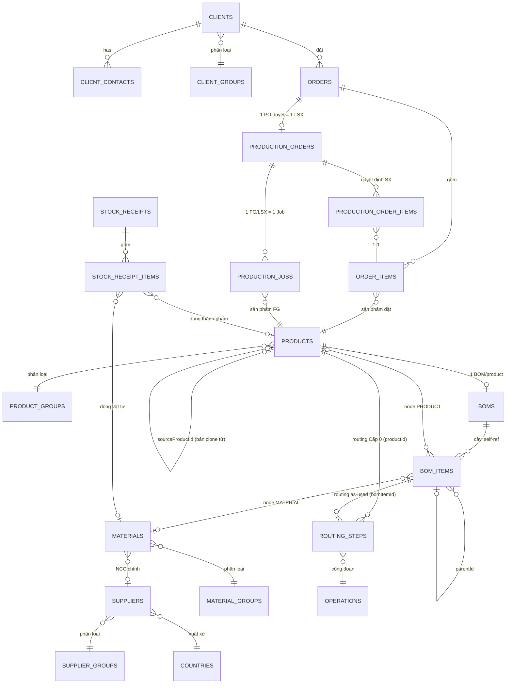

# Kiến trúc miền dữ liệu

Bản đồ xuyên suốt các bảng chính và cách chúng nối với nhau — khác `docs/features/<x>.md` (business
rules + API contract của từng module), file này chỉ trả lời "cái gì trỏ vào cái gì" và "ghi theo thứ
tự nào khi một thao tác chạm nhiều module". Đọc trước khi sửa bất kỳ luồng nào chạm ≥ 2 module.

## Sơ đồ ER theo cụm

Master data (`client-groups`, `supplier-groups`, `material-groups`, `product-groups`, `countries`,
`departments`, `positions`, `units`, `operations`) chỉ được tham chiếu, không tham chiếu ngược — bỏ
khỏi sơ đồ trên cho gọn, xem `docs/features/master-data.md`.

## Thứ tự ghi của các luồng bắc cầu nhiều module

**Tạo/sửa sản phẩm** (`ProductsService`): row `products` → `product_attachments` (nếu có) → cây
`boms`/`bom_items` (tạo BOM rỗng cùng lúc tạo product) → `routing_steps` viết riêng theo từng node
qua `/products/:productId/bom/items/:itemId/operations*`. `POST /products/:id/copy` lặp lại đúng thứ
tự này cho toàn bộ cây, ghi `sourceProductId` vào bản clone.

**Duyệt đơn hàng** (`OrdersService.approveOrder`, `DRAFT`/`PENDING_CONFIRMATION` → `AWAITING_PRODUCTION`):
đọc `InventoryService.getStockLevels` (chỉ đọc, chạy trước transaction) → trong transaction: update
`orders.status` → `ProductionOrdersService.seedPlan` tạo `production_orders` (header, `PENDING`) +
`production_order_items` (1-1 với `order_items`, Đề xuất SX = onHand − reserved, trừ demand của
chính PO này).

**Duyệt LSX** (`ProductionOrdersService.approveProductionOrder`, `PENDING` → `APPROVED`): đọc
`production_order_items`, gộp SL theo `productId` (chỉ giữ SL > 0) → trong transaction: sinh mã
`LSXxxxx`, update `production_orders.status` → update `orders.status = IN_PROGRESS` →
`ProductionJobsService.createJobs` tạo 1 `production_jobs` row/sản phẩm.

## Bất biến xuyên module

Những sự thật này không nằm trọn trong một `docs/features/<x>.md` nào — mỗi cái nối ≥ 2 module.

- **`orders` snapshot liên hệ, không FK.** `contactName`/`contactPhone`/`contactEmail` trên
  `orders` là bản chụp một dòng `client_contacts` tại thời điểm submit, không phải FK — vì
  `ClientsService.replaceContacts` xoá+chèn lại toàn bộ contact mỗi lần sửa client, nên id contact
  không ổn định để tham chiếu lâu dài.
- **`routing_steps` khoá theo đúng một trong `productId`/`bomItemId`** (CHECK
  `chk_routing_steps_target`). Cùng một WIP xuất hiện ở 2 vị trí cha khác nhau trong 2 cây BOM khác
  nhau có thể mang routing khác nhau — routing là "as-used" theo node, không phải thuộc tính của
  sản phẩm.
- **`bom_items` cũng khoá theo đúng một trong `productId`/`materialId`** — cùng nguyên tắc trên,
  một node lá là PRODUCT (đệ quy xuống BOM con) hoặc MATERIAL, không bao giờ cả hai.
- **`stock_receipts.subject` (`FINISHED_GOOD`/`MATERIAL`) quyết định `stock_receipt_items` dùng
  `productId` hay `materialId`** (CHECK `chk_stock_receipt_items_target` chỉ đảm bảo "đúng một
  trong hai" ở tầng dòng — khớp đúng `subject` của header là trách nhiệm của
  `StockReceiptsService.ensureItemsValid`, DB không tự kiểm được vì CHECK không đọc được row cha).
- **1 PO duyệt = 1 LSX** (`production_orders.orderId` unique, `onDelete: 'restrict'`) — không có
  khái niệm nhiều LSX cho một đơn.
- **1 sản phẩm FG = 1 Job trong một LSX**, gộp mọi dòng `production_order_items` cùng `productId`
  trong cùng LSX đó — Job là đơn vị công việc thực tế của xưởng, không phải đơn vị kế toán kho nên
  không giữ 1-1 với `orderItemId`.
- **File đính kèm luôn qua registry `files`**, không bao giờ là URL trần — ngoại lệ duy nhất là
  `countries.logoUrl` (danh mục nhỏ, không cần registry). Mọi module khác (`products`, `materials`,
  `orders`, `suppliers`) dùng `*_attachment_file_ids`/`*FileId` trỏ `files.id`.
- **`orders.staffId` là FK nghiệp vụ duy nhất trỏ `users.id`** — mọi FK "ai đã làm việc này" khác
  (`createdBy`, `approvedBy`, `startedBy`, ...) trỏ `credentials.id`.

## Xem thêm

- `docs/features/<x>.md` — business rules + API contract từng module.
- `.claude/rules/database.md` — quy ước viết schema (naming, timestamp, enum).
