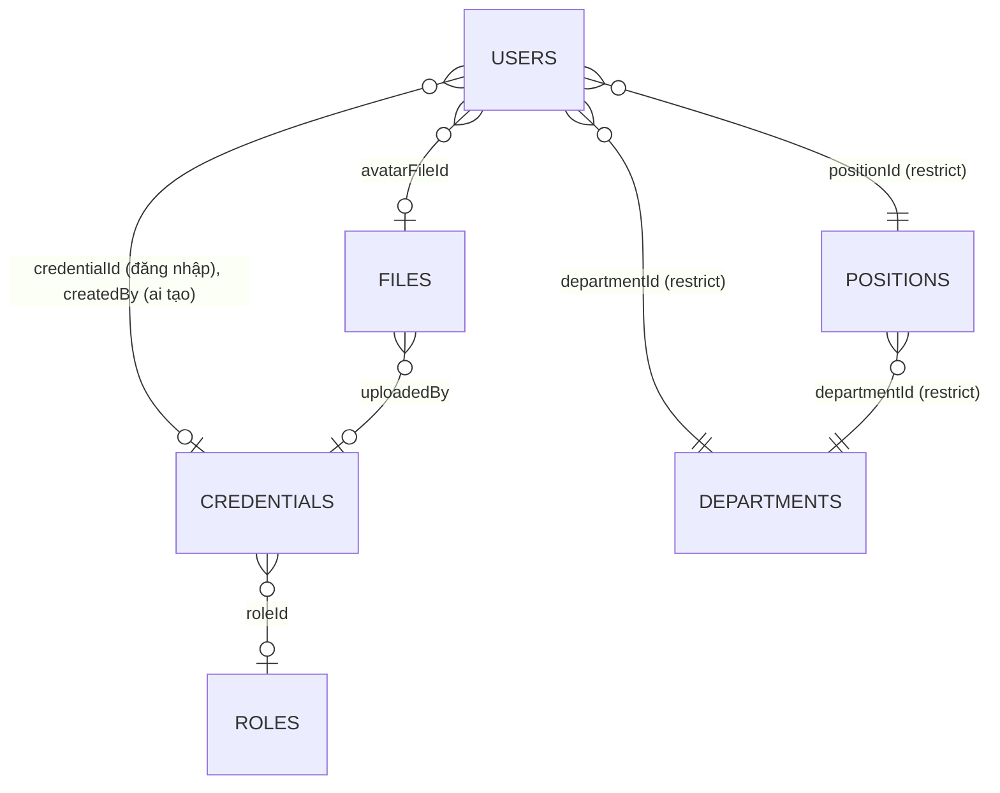

# Kiến trúc miền dữ liệu

Bản đồ xuyên suốt các bảng chính và cách chúng nối với nhau — khác `docs/domains/<x>.md` (business
rules + API contract của từng module), file này chỉ trả lời "cái gì trỏ vào cái gì" và "ghi theo thứ
tự nào khi một thao tác chạm nhiều module". Đọc trước khi sửa bất kỳ luồng nào chạm ≥ 2 module.

Template này chỉ còn cụm `identity-access` (auth/users/roles/files + hai danh mục
departments/positions) — mọi luồng nghiệp vụ khác (đơn hàng, sản xuất, kho...) đã bị xoá khi tách
nhánh base. Thêm domain mới thì viết lại file này theo đúng khuôn dưới đây.

## Sơ đồ ER

`roles.permissions` là mảng `jsonb` (`PermissionCode[]`), không phải bảng join — không có
`role_permissions`.

## Thứ tự ghi của luồng bắc cầu nhiều module

**Tạo user** (`UsersService.createUser`): đọc trước (song song) — tồn tại `departmentId`, tồn tại
`positionId` **thuộc đúng** `departmentId` đó (`E064` nếu lệch); nếu có `avatarFileId`, gọi
`FilesService.linkFiles` **trước khi ghi bất kỳ dòng nào** (đảo thứ tự có thể để lại file bị
`FilesCleanupService` sweep mất sau khi đã gán cho user). Ghi: tạo `credentials` trước (nếu request
có `credential`), rồi mới `insert users` với `credentialId` vừa tạo — thứ tự này để một lần tạo
credential lỗi (trùng username/email) không để lại `users` row mồ côi. **Không có `db.transaction`
bọc hai write này** — đây là ví dụ call-order-constraint thật của template, không phải
multi-write-transaction (`.claude/rules/transactions.md`: chưa service nào trong template cần
transaction).

## Chuỗi import module (NestJS DI)

Không vòng phụ thuộc: `UsersModule → [AuthModule, FilesModule]`, `FilesModule → AuthModule`.
`RolesModule`/`DepartmentsModule`/`PositionsModule`/`HealthModule` không import module nào khác.

## Bất biến xuyên module

- **File đính kèm luôn qua registry `files`**, không bao giờ là URL trần. Hiện chỉ `users.avatarFileId`
  dùng registry này. Chi tiết: `docs/decisions/files-registry.md`.
- **Mọi FK "ai đã tạo/tải lên"** (`users.createdBy`, `files.uploadedBy`) trỏ `credentials.id` — đại
  diện cho danh tính đăng nhập, không phải `users.id` (đại diện cho hồ sơ nhân sự). Không có bảng
  nghiệp vụ nào khác trong template này FK trực tiếp vào `users.id`.

## Xem thêm

- `docs/domains/identity-access.md` — vòng đời credential/user/role, permission model, guard order.
- `.claude/rules/database.md` — quy ước viết schema (naming, timestamp, enum, soft delete).
