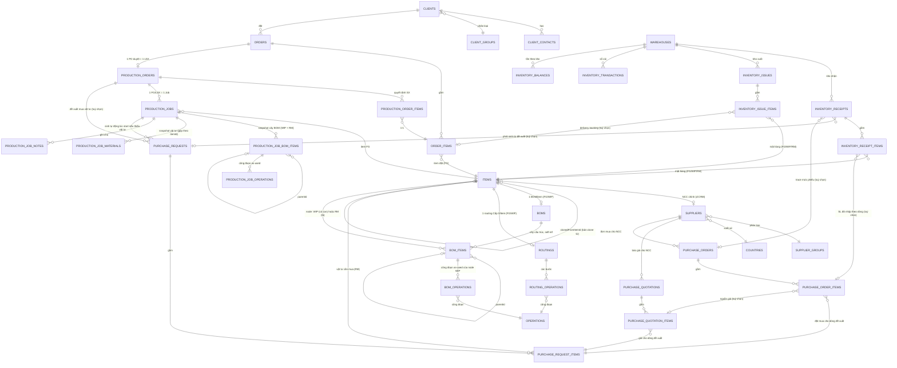

# Kiến trúc miền dữ liệu

Bản đồ xuyên suốt các bảng chính và cách chúng nối với nhau — khác `docs/domains/<x>.md` (business
rules + API contract của từng module), file này chỉ trả lời "cái gì trỏ vào cái gì" và "ghi theo thứ
tự nào khi một thao tác chạm nhiều module". Đọc trước khi sửa bất kỳ luồng nào chạm ≥ 2 module.

## Sơ đồ ER theo cụm

Master data (`client-groups`, `supplier-groups`, `countries`, `departments`, `positions`, `units`,
`operations`) chỉ được tham chiếu, không tham chiếu ngược — bỏ khỏi sơ đồ trên cho gọn, xem
`docs/domains/partners.md`. `items` không còn nhóm hàng hoá — `type` (FG/WIP/RM) là thứ duy nhất
phân loại, xem `docs/decisions/items-merge.md`.

## Thứ tự ghi của các luồng bắc cầu nhiều module

**Tạo item** (`ItemsService.createItem`): một `INSERT` đơn vào `items`, không cần transaction.
**`boms`/`bom_items`/`routings`/`routing_operations` KHÔNG được tạo ở bước này** — cả BOM lẫn
routing Cấp 0 sinh ra lười (get-or-create), ngay trong transaction ghi dòng đầu tiên. BOM ghi qua
`POST /items/:itemId/bom/items` (`BomsModule`) — một node có thể trỏ WIP (node) hoặc RM (lá).
`bom_operations` viết riêng qua `.../bom/items/:bomItemId/operations` (`BomOperationsModule`), luôn
gắn vào một node WIP có sẵn. Routing Cấp 0 viết riêng qua `POST /items/:itemId/operations`
(`RoutingsModule`, tạo lười `routings` + `routing_operations`). `POST /items/:id/copy` (chỉ
FG/WIP, `E110` nếu RM) đọc trước toàn bộ cây `bom_items` rồi ghi lại tất cả — kể cả header `boms` —
trong một transaction, ghi `clonedFromItemId` vào bản clone; **không** clone routing Cấp 0 hay
`bom_operations` (xem `docs/domains/product-structure.md`, mục "Related docs" của
`docs/decisions/items-merge.md`). Chi tiết từng bước: `docs/workflows/product-setup.md`.

**Duyệt đơn hàng** (`OrdersService.approveOrder`, chỉ hợp lệ từ `PENDING_CONFIRMATION` — `E074` nếu
không, `DRAFT` chưa gửi duyệt thì chưa duyệt được): đọc `InventoryService.getStockLevels` (chỉ đọc,
chạy trước transaction) → trong transaction: update `orders.status = AWAITING_PRODUCTION` →
`ProductionOrdersService.seedPlan` tạo `production_orders` (header, `PENDING`) +
`production_order_items` (1-1 với `order_items`, Đề xuất SX = onHand − reserved, trừ demand của
chính PO này). Chi tiết từng bước: `docs/workflows/order-approval.md`.

**Duyệt LSX** (`ProductionOrdersService.approveProductionOrder`, `PENDING` → `APPROVED`): đọc
`production_order_items`, gộp SL theo `itemId` (chỉ giữ SL > 0) → trong transaction: sinh mã
`LSXxxxx`, update `production_orders.status` → update `orders.status = IN_PROGRESS` →
`ProductionJobsService.createJobs` tạo 1 `production_jobs` row/item FG, rồi nhân bản toàn bộ cây
`bom_items` (WIP + RM) sang `production_job_bom_items`, copy routing as-used của từng node WIP sang
`production_job_operations`, và gộp riêng mọi lá RM theo `itemId` × SL Job sang
`production_job_materials` — cùng trong transaction này.

**Post/cancel phiếu kho** (`InventoryReceiptsService.postInventoryReceipt`/`InventoryIssuesService.postInventoryIssue`,
chỉ hợp lệ từ `DRAFT`): validate kho + dòng phiếu (đọc, ngoài transaction) → trong transaction, gọi
`InventoryPostingService.postDocument` — khoá từng dòng `inventory_balances` liên quan bằng
`SELECT … FOR UPDATE`, cộng/trừ theo dấu bút toán, ghi `inventory_transactions`, rồi update
`status` phiếu. `cancel` từ `POSTED` gọi `InventoryPostingService.reverseDocument` cùng khuôn, ghi
bút toán đảo dấu thay vì xoá. Chi tiết: `docs/workflows/stock-movement.md`.

**Start Job** (`ProductionJobsService.startJob`, chỉ hợp lệ từ `PENDING`): đọc
`production_job_materials` + `InventoryService.getMaterialStockLevels` (chỉ đọc, chạy trước
transaction) để tính vật tư thiếu → trong transaction: update `production_jobs.status =
IN_PROGRESS` → nếu có thiếu, `PurchaseRequestsService.createShortageRequest` ghi thêm
`purchase_requests` (`DRAFT`) + `purchase_request_items` cho đúng phần thiếu. Không thiếu gì thì
transaction chỉ có đúng một `UPDATE`. Chi tiết: `docs/workflows/production-job-execution.md`.

**Sổ cái mua hàng** (`GET /purchase-ledger`, `docs/domains/purchasing.md`): thuần đọc, không
transaction — một `.select()` + join gộp `purchase_request_items` (phiếu `APPROVED`) với ba
subquery aggregate (SL đặt mua từ `purchase_order_items`, SL đã nhập từ `inventory_receipt_items`
lọc `POSTED`, trạng thái báo giá từ `purchase_quotation_items`) cộng hai subquery tồn/nhu cầu của
`item-stock.query.ts`. Bảy trạng thái + `pendingPurchaseSince` tính bằng `CASE WHEN` ngay trong câu
lệnh, không lọc ở tầng JS.

## Chuỗi import module (NestJS DI)

Không vòng phụ thuộc nào trong chuỗi dưới — mỗi mũi tên là một chiều `imports` duy nhất:

`OrdersModule → ProductionOrdersModule → ProductionJobsModule`. `ProductionOrdersModule` chỉ
import `AuthModule`/`InventoryModule` (không import ngược `OrdersModule`), nên
`OrdersService.approveOrder` gọi thẳng `ProductionOrdersService` mà không vòng. Tương tự
`ProductionOrdersService.approveProductionOrder` gọi `ProductionJobsService.createJobs` — chỉ vì
`ProductionJobsModule` không import ngược `ProductionOrdersModule`.

`ProductionJobsModule` import thêm `InventoryModule`/`PurchaseRequestsModule` (cho
`startJob`). Chiều còn lại không tồn tại — `PurchaseRequestsModule` không import
`ProductionJobsModule`, chỉ `export: [PurchaseRequestsService]` để bị inject vào.

`BomsModule`/`RoutingsModule` không import `ItemsModule` — cả hai truy vấn
`items`/`boms`/`bom_items`/`routings`/`routing_operations`/`operations` thẳng qua `DRIZZLE`, không
qua service của module khác. `BomsModule` import `FilesModule` để link/xoá file bản vẽ của node;
`RoutingsModule` không cần vì routing không mang file riêng. `BomOperationsModule` import
`BomsModule` để dùng chung `ensureItemExists`/`ensureBomItemInBom`/`ensureBomItemCanHaveOperations`
(public trên `BomsService`) — chiều ngược lại không tồn tại.

## Bất biến xuyên module

Những sự thật này không nằm trọn trong một `docs/domains/<x>.md` nào — mỗi cái nối ≥ 2 module.

- **`products`/`materials` gộp thành `items`** (`type = FG | WIP | RM`), kéo `bom_materials` gộp
  vào `bom_items` và `product_operations` (bảng phẳng) đổi thành cặp header/detail
  `routings`/`routing_operations` — xem `docs/decisions/items-merge.md`. Đừng tìm ba bảng cũ.
- **`routings` là routing Cấp 0** — `itemId` NOT NULL, unique, chỉ routing của chính item gốc (FG
  hoặc WIP). Routing as-used của một node sống ở `bom_operations` (`bomItemId` NOT NULL, chỉ gắn
  được vào node WIP). Cùng một WIP xuất hiện ở 2 vị trí cha khác nhau trong 2 cây BOM khác nhau có
  thể mang routing khác nhau — as-used theo node, không phải thuộc tính của item.
- **`bom_items` chứa cả node WIP lẫn lá RM** — mọi node luôn trỏ một `itemId` NOT NULL, loại node
  (có thể có con hay là lá) suy từ `items.type` của item được trỏ tới, không phải một cột riêng
  trên `bom_items`.
- **Mọi bảng kho** (`inventory_receipt_items`, `inventory_issue_items`, `inventory_transactions`,
  `inventory_balances`) chỉ còn một `itemId` NOT NULL — không còn discriminator `itemType`, không
  còn CHECK XOR. `warehouses.type` **không** ràng buộc loại item được phép nhập/xuất — quyết định
  nghiệp vụ, xem `docs/domains/inventory.md`.
- **`inventory_balances` là bản chiếu dựng lại được từ `inventory_transactions`**, không phải nguồn
  sự thật độc lập — chỉ `InventoryPostingService.postDocument`/`reverseDocument` được ghi vào cả
  hai bảng này, gọi từ `InventoryReceiptsService`/`InventoryIssuesService` lúc `post`/`cancel`.
- **1 PO duyệt = 1 LSX** (`production_orders.orderId` unique, `onDelete: 'restrict'`) — không có
  khái niệm nhiều LSX cho một đơn.
- **1 item FG = 1 Job trong một LSX**, gộp mọi dòng `production_order_items` cùng `itemId`
  trong cùng LSX đó — Job là đơn vị công việc thực tế của xưởng, không phải đơn vị kế toán kho nên
  không giữ 1-1 với `orderItemId`.
- **File đính kèm luôn qua registry `files`**, không bao giờ là URL trần — ngoại lệ duy nhất là
  `countries.logoUrl` (danh mục nhỏ, không cần registry). Bốn bảng khác (`orders`, `suppliers`,
  `boms` — `drawingFileId` trên `bom_items`, `users` — `avatarFileId`) dùng
  `*_attachment_file_ids`/`*FileId` trỏ `files.id`; `items` chỉ còn `imageFileId` — không có bảng
  đính kèm riêng, kể cả cho RM (`docs/domains/product-structure.md`). Chi tiết:
  `docs/decisions/files-registry.md`.
- **Mọi FK "ai đã làm việc này"** (`createdBy`, `approvedBy`, `startedBy`, `orders.assignedUserId`,
  ...) trỏ `users.id`, không phải `credentials.id` (đảo lại 2026-08-01 — `orders.assignedUserId`
  từng là ngoại lệ duy nhất, giờ mọi cột audit dùng chung một quy ước). Xem
  `docs/domains/identity-access.md`.

## Xem thêm

- `docs/workflows/<flow>.md` — trình tự chạy của từng luồng nghiệp vụ đầu-cuối.
- `.claude/rules/database.md` — quy ước viết schema (naming, timestamp, enum).
