# Kiến trúc miền dữ liệu

Bản đồ xuyên suốt các bảng chính và cách chúng nối với nhau — khác `docs/domains/<x>.md` (business
rules + API contract của từng module), file này chỉ trả lời "cái gì trỏ vào cái gì" và "ghi theo thứ
tự nào khi một thao tác chạm nhiều module". Đọc trước khi sửa bất kỳ luồng nào chạm ≥ 2 module.

## Sơ đồ ER theo cụm

```mermaid
erDiagram
    CLIENTS ||--o{ CLIENT_CONTACTS : has
    CLIENTS }o--|| CLIENT_GROUPS : "phân loại"
    SUPPLIERS }o--|| SUPPLIER_GROUPS : "phân loại"
    SUPPLIERS }o--|| COUNTRIES : "xuất xứ"
    ITEMS }o--o| SUPPLIERS : "NCC chính (chỉ RM)"
    ITEMS }o--o| ITEMS : "clonedFromItemId (bản clone từ)"

    ITEMS ||--o| BOMS : "1 BOM/item (FG/WIP)"
    BOMS ||--o{ BOM_ITEMS : "cây cấu trúc, self-ref"
    BOM_ITEMS }o--o| BOM_ITEMS : "parentId"
    BOM_ITEMS }o--|| ITEMS : "node: WIP (có con) hoặc RM (lá)"
    BOM_ITEMS ||--o{ BOM_OPERATIONS : "công đoạn as-used của node WIP"
    BOM_OPERATIONS }o--|| OPERATIONS : "công đoạn"
    ITEMS ||--o| ROUTINGS : "1 routing Cấp 0/item (FG/WIP)"
    ROUTINGS ||--o{ ROUTING_OPERATIONS : "các bước"
    ROUTING_OPERATIONS }o--|| OPERATIONS : "công đoạn"

    CLIENTS ||--o{ ORDERS : đặt
    ORDERS ||--o{ ORDER_ITEMS : gồm
    ORDER_ITEMS }o--|| ITEMS : "item đặt (FG)"
    CLIENTS ||--o{ OUTBOUND_ORDERS : "1 phiếu DO = 1 khách hàng"
    WAREHOUSES ||--o{ OUTBOUND_ORDERS : "kho xuất TP (phase sau)"
    OUTBOUND_ORDERS ||--o{ OUTBOUND_ORDER_ITEMS : "dòng giao"
    ORDER_ITEMS ||--o{ OUTBOUND_ORDER_ITEMS : "dòng PO nguồn (giao nhiều lần)"
    PRODUCTION_JOBS }o--o| OUTBOUND_ORDER_ITEMS : "snapshot Job hiển thị (tuỳ chọn)"
    ORDERS ||--o| PRODUCTION_ORDERS : "1 PO duyệt = 1 LSX"
    PRODUCTION_ORDERS ||--o{ PRODUCTION_ORDER_ITEMS : "quyết định SX"
    PRODUCTION_ORDER_ITEMS }o--|| ORDER_ITEMS : "1-1"
    PRODUCTION_ORDERS ||--o{ PRODUCTION_JOBS : "1 FG/LSX = 1 Job"
    PRODUCTION_JOBS }o--|| ITEMS : "item FG"
    PRODUCTION_JOBS ||--o{ PRODUCTION_JOB_BOM_ITEMS : "snapshot cây BOM (WIP + RM)"
    PRODUCTION_JOB_BOM_ITEMS }o--o| PRODUCTION_JOB_BOM_ITEMS : "parentId"
    PRODUCTION_JOB_BOM_ITEMS ||--o{ PRODUCTION_JOB_OPERATIONS : "công đoạn as-used"
    PRODUCTION_JOBS ||--o{ PRODUCTION_JOB_ISSUES : "snapshot vật tư (gộp theo itemId)"
    PRODUCTION_JOB_ISSUES }o--|| PRODUCTION_JOB_ITEMS : "mã/tên vật tư (bảng chiều, SCD)"
    PRODUCTION_JOB_ISSUES }o--|| PRODUCTION_JOB_UNITS : "mã/tên ĐVT (bảng chiều, SCD)"
    PRODUCTION_JOBS ||--o{ PRODUCTION_JOB_NOTES : "ghi chú"

    PRODUCTION_ORDERS ||--o{ PURCHASE_REQUESTS : "đề xuất mua vật tư (tuỳ chọn)"
    PRODUCTION_JOBS ||--o{ PURCHASE_REQUESTS : "sinh tự động lúc start nếu thiếu vật tư"
    PURCHASE_REQUESTS ||--o{ PURCHASE_REQUEST_ITEMS : gồm
    PURCHASE_REQUEST_ITEMS }o--|| ITEMS : "vật tư cần mua (RM)"

    WAREHOUSES ||--o{ INVENTORY_RECEIPTS : "kho nhận"
    WAREHOUSES ||--o{ INVENTORY_ISSUES : "kho xuất"
    WAREHOUSES ||--o{ INVENTORY_TRANSACTIONS : "sổ cái"
    WAREHOUSES ||--o{ INVENTORY_BALANCES : "tồn theo kho"
    INVENTORY_RECEIPTS ||--o{ INVENTORY_RECEIPT_ITEMS : gồm
    INVENTORY_ISSUES ||--o{ INVENTORY_ISSUE_ITEMS : gồm
    INVENTORY_RECEIPT_ITEMS }o--|| ITEMS : "mặt hàng (FG/WIP/RM)"
    INVENTORY_ISSUE_ITEMS }o--|| ITEMS : "mặt hàng (FG/WIP/RM)"
    INVENTORY_ISSUE_ITEMS }o--o| ORDER_ITEMS : "delivery tracking (tuỳ chọn)"
    INVENTORY_RECEIPTS }o--o| PURCHASE_REQUESTS : "phát sinh từ đề xuất (tuỳ chọn)"

    WAREHOUSES ||--o{ INVENTORY_REQUISITIONS : "kho lãnh"
    PRODUCTION_JOBS }o--o| INVENTORY_REQUISITIONS : "Job liên quan (bắt buộc nếu type=PRODUCTION)"
    INVENTORY_REQUISITIONS ||--o{ INVENTORY_REQUISITION_ITEMS : gồm
    INVENTORY_REQUISITION_ITEMS }o--|| ITEMS : "vật tư lãnh (RM)"
    INVENTORY_REQUISITIONS ||--o| INVENTORY_ISSUES : "tự sinh lúc issue (POSTED ngay)"

    PURCHASE_QUOTATIONS ||--o{ PURCHASE_QUOTATION_ITEMS : "gồm (1 dòng/vật tư)"
    PURCHASE_QUOTATION_ITEMS }o--|| PURCHASE_REQUEST_ITEMS : "hỏi giá cho dòng đề xuất"
    PURCHASE_QUOTATION_ITEMS ||--o{ PURCHASE_QUOTATION_ITEM_SUPPLIERS : "giá của từng NCC"
    PURCHASE_QUOTATION_ITEM_SUPPLIERS }o--|| SUPPLIERS : "NCC được hỏi giá"
    SUPPLIERS ||--o{ PURCHASE_ORDERS : "đơn mua cho NCC"
    PURCHASE_QUOTATIONS ||--o{ PURCHASE_ORDERS : "duyệt RFQ tự sinh PO Draft (tuỳ chọn)"
    PURCHASE_ORDERS ||--o{ PURCHASE_ORDER_ITEMS : gồm
    PURCHASE_ORDER_ITEMS }o--|| PURCHASE_REQUEST_ITEMS : "đặt mua cho dòng đề xuất"
    PURCHASE_ORDER_ITEMS }o--o| PURCHASE_QUOTATION_ITEM_SUPPLIERS : "NCC + giá đã chốt (tuỳ chọn)"
    INVENTORY_RECEIPTS }o--o| PURCHASE_ORDERS : "trace mức phiếu (tuỳ chọn)"
    INVENTORY_RECEIPT_ITEMS }o--o| PURCHASE_ORDER_ITEMS : "SL đã nhập theo dòng (tuỳ chọn)"

    WAREHOUSES ||--o{ SUPPLIER_RETURNS : "kho xuất trả"
    SUPPLIERS ||--o{ SUPPLIER_RETURNS : "NCC nhận trả"
    SUPPLIER_RETURNS }o--|| ITEMS : "vật tư trả"
    SUPPLIER_RETURNS }o--o| PURCHASE_ORDERS : "trace mức phiếu (tuỳ chọn)"
    SUPPLIER_RETURNS }o--o| INVENTORY_RECEIPTS : "trace mức phiếu (tuỳ chọn)"

    SUPPLIERS ||--o{ QUALITY_INSPECTIONS : "NCC bị kiểm (kind=INCOMING)"
    QUALITY_INSPECTIONS }o--|| ITEMS : "vật tư/part kiểm"
    QUALITY_INSPECTIONS }o--o| INVENTORY_RECEIPTS : "trace mức phiếu (tuỳ chọn, INCOMING)"
    QUALITY_INSPECTIONS }o--o| PURCHASE_ORDERS : "trace mức phiếu (tuỳ chọn, INCOMING)"
    QUALITY_INSPECTIONS }o--o| DEPARTMENTS : "bộ phận QC (tuỳ chọn, INCOMING)"
    QUALITY_INSPECTIONS }o--o| PRODUCTION_JOB_OPERATIONS : "anchor (OUTGOING bắt buộc, INCOMING khi từ OS-IN)"
    QUALITY_INSPECTIONS ||--o{ QC_FILES : "bằng chứng QC + quyết định xử lý"
    QC_FILES }o--|| FILES : "file đính kèm"
    QUALITY_INSPECTIONS ||--o{ SUPPLIER_RETURNS : "tự sinh khi disposition SORT/RETURN (INCOMING only)"

    WAREHOUSES ||--o{ OUTSOURCING_ORDERS : "kho gửi"
    SUPPLIERS ||--o{ OUTSOURCING_ORDERS : "NCC gia công"
    OUTSOURCING_ORDERS ||--o{ OUTSOURCING_ORDER_ITEMS : "dòng gửi"
    PRODUCTION_JOB_OPERATIONS }o--o| OUTSOURCING_ORDER_ITEMS : "anchor (Job IN_PROGRESS, type=OUTSOURCE)"
    OUTSOURCING_ORDER_ITEMS }o--|| ITEMS : "vật tư gửi"
    SUPPLIERS ||--o{ OUTSOURCING_RECEIPTS : "NCC gia công"
    OUTSOURCING_RECEIPTS ||--o{ OUTSOURCING_RECEIPT_ITEMS : "dòng nhận"
    OUTSOURCING_ORDER_ITEMS ||--o{ OUTSOURCING_RECEIPT_ITEMS : "nhận (partial)"
    OUTSOURCING_RECEIPT_ITEMS }o--|| ITEMS : "vật tư nhận (denormalized)"
    OUTSOURCING_RECEIPTS }o--o| QUALITY_INSPECTIONS : "sinh IQC (kind=INCOMING) nếu requiresIqc"
    QUALITY_INSPECTIONS }o--o| OUTSOURCING_RECEIPTS : "trace mức phiếu (tuỳ chọn)"
    QUALITY_INSPECTIONS }o--o| OUTSOURCING_RECEIPT_ITEMS : "trace mức dòng (tuỳ chọn, INCOMING)"
    SUPPLIER_RETURNS }o--o| OUTSOURCING_RECEIPTS : "trace mức phiếu (tuỳ chọn)"
```

Master data (`client-groups`, `supplier-groups`, `countries`, `departments`, `positions`, `units`,
`operations`) chỉ được tham chiếu, không tham chiếu ngược — bỏ khỏi sơ đồ trên cho gọn, xem
`docs/domains/partners.md`. `items` không còn nhóm hàng hoá — `type` (FG/WIP/RM) là thứ duy nhất
phân loại, xem `docs/decisions/items-merge.md`.

## Thứ tự ghi của các luồng bắc cầu nhiều module

**Tạo item** (`ItemsService.createItem`): transaction bao cấp mã (`document_sequences`) + một
`INSERT` vào `items`, không ghi bảng nào khác.
**`boms`/`bom_items`/`routings`/`routing_operations` KHÔNG được tạo ở bước này** — cả BOM lẫn
routing Cấp 0 sinh ra lười (get-or-create), ngay trong transaction ghi dòng đầu tiên. BOM ghi qua
`POST /items/:itemId/bom/items` (`BomsModule`) — một node có thể trỏ WIP (node) hoặc RM (lá).
`bom_operations` viết riêng qua `.../bom/items/:bomItemId/operations` (`BomOperationsModule`), luôn
gắn vào một node WIP có sẵn. Routing Cấp 0 viết riêng qua `POST /items/:itemId/operations`
(`RoutingsModule`, tạo lười `routings` + `routing_operations`). `POST /items/:id/copy` (chỉ
FG/WIP, `E110` nếu RM) đọc trước toàn bộ cây `bom_items` rồi ghi lại tất cả — kể cả header `boms` —
trong một transaction, ghi `clonedFromItemId` vào bản clone; **không** clone routing Cấp 0 hay
`bom_operations` (xem `docs/domains/product-structure.md`, mục "Related docs" của
`docs/decisions/items-merge.md`). Chi tiết từng bước: `docs/workflows/product-setup.md`.

**Duyệt đơn hàng** (`OrdersService.approveOrder`, chỉ hợp lệ từ `PENDING_CONFIRMATION` — `E074` nếu
không, `DRAFT` chưa gửi duyệt thì chưa duyệt được): đọc `InventoryService.getStockLevels` (chỉ đọc,
chạy trước transaction) → trong transaction: update `orders.status = AWAITING_PRODUCTION` →
`ProductionOrdersService.seedPlan` tạo `production_orders` (header, `PENDING`) +
`production_order_items` (1-1 với `order_items`, Đề xuất SX = onHand − reserved, trừ demand của
chính PO này). Chi tiết từng bước: `docs/workflows/order-approval.md`.

**Duyệt LSX** (`ProductionOrdersService.approveProductionOrder`, `PENDING` → `APPROVED`): đọc
`production_order_items`, gộp SL theo `itemId` (chỉ giữ SL > 0) → trong transaction: sinh mã
`LSXxxxx`, update `production_orders.status` → update `orders.status = IN_PROGRESS` →
`ProductionJobsService.createJobs` tạo 1 `production_jobs` row/item FG, rồi nhân bản toàn bộ cây
`bom_items` (WIP + RM) sang `production_job_bom_items`, copy routing as-used của từng node WIP sang
`production_job_operations`, và gộp riêng mọi lá RM theo `itemId` × SL Job sang
`production_job_issues` — cùng trong transaction này. Trước khi ghi `production_job_issues`,
get-or-create theo bộ ba nội dung (mã/tên) hai bảng chiều dùng chung
`production_job_items`/`production_job_units`, cùng transaction (`docs/domains/production.md`).

**Post/cancel phiếu kho** (`InventoryReceiptsService.postInventoryReceipt`/`InventoryIssuesService.postInventoryIssue`,
hợp lệ từ `PENDING_RECEIPT`/`PENDING_IQC` — phiếu nhập có nhánh IQC, xem
`docs/workflows/receipt-confirmation.md`): validate kho + dòng phiếu (đọc, ngoài transaction) →
trong transaction, gọi `InventoryPostingService.postDocument` — khoá từng dòng `inventory_balances`
liên quan bằng `SELECT … FOR UPDATE`, cộng/trừ theo dấu bút toán, ghi `inventory_transactions`, rồi
update `status` phiếu. Phiếu nhập gắn `purchaseOrderId` thì gọi thêm
`PaymentRequestsService.createIfOrderCompleted(tx, purchaseOrderId)` cùng transaction — tự sinh yêu
cầu thanh toán nếu PO vừa đạt đủ hàng (`docs/domains/purchasing.md`). `cancel` từ `POSTED` gọi
`InventoryPostingService.reverseDocument` cùng khuôn, ghi bút toán đảo dấu thay vì xoá. Chi tiết:
`docs/workflows/stock-movement.md`.

**Duyệt/Xuất phiếu lãnh vật tư** (`InventoryRequisitionsService.approveInventoryRequisition`/
`issueInventoryRequisition`, `docs/workflows/inventory-requisition.md`): `approve` chỉ đọc/ghi
`inventory_requisitions`/`inventory_requisition_items` + `inventory_balances` (khoá `FOR UPDATE`,
không ghi) trong 1 transaction — không đụng module khác. `issue` mới bắc cầu: trong 1 transaction,
sinh mã `PXK-{năm}-{5}` → `INSERT inventory_issues` (`POSTED` ngay, không qua `DRAFT`) +
`inventory_issue_items` copy từ dòng phiếu lãnh → `InventoryPostingService.postDocument` (trừ
`inventory_balances`, ghi `inventory_transactions`) → `UPDATE inventory_requisitions.status =
ISSUED, inventoryIssueId`. Cùng khuôn ranh giới transaction với
`InventoryIssuesService.postInventoryIssue`, khác ở chỗ tự sinh phiếu xuất thay vì đọc phiếu có sẵn.

**Tạo OS-OUT/OS-IN** (`OutsourcingOrdersService.createOutsourcingOrder`/`OutsourcingReceiptsService.
createOutsourcingReceipt`): không có bước nháp — `create` gộp luôn phần việc trước đây thuộc `post`
(`docs/decisions/outsourcing-no-draft.md`), nhưng **không đụng `inventory_balances`/
`inventory_transactions`** — mặt hàng gửi gia công ngoài luôn là WIP, kho không quản tồn WIP
(`docs/decisions/wip-not-stocked.md`). Validate mềm chạy trước, ngoài transaction (đọc
`production_job_operations.type`/`production_jobs.status` + cột
`production_job_bom_items.plannedQuantity` — chỉ đọc, không ghi ngược Production); trong
transaction: `INSERT` header thẳng `POSTED` + `INSERT` mọi dòng
(`.returning()`) → validate lại lần hai trên dữ liệu vừa insert (chốt chặn thật, loại chính phiếu
đang tạo). Riêng `createOutsourcingReceipt` có thêm một nhánh tuỳ chọn sau đó: nếu
`requiresIqc = true`, cùng transaction gọi thêm
`IqcService.createInspectionsFromOutsourcingReceipt(tx, ...)` — sinh N phiếu IQC (1/dòng phiếu),
bắc cầu sang module `iqc`, nhưng **không** gate việc tạo phiếu (khác nhánh IQC của
`inventory-receipts`). Chi tiết: `docs/workflows/outsourcing-round-trip.md`.

**Tạo DO** (`OutboundOrdersService.createOutboundOrder`, phase 1 — chỉ tạo nháp, xem
`docs/domains/inventory.md`, mục "Giao hàng"): validate chạy trước transaction (đọc
`order_items`/`orders`, chặn SL dòng vượt SL đặt — chỉ đọc, không ghi ngược Orders,
`OutboundOrdersModule` không import `OrdersModule`, đọc thẳng qua `DRIZZLE` cùng lối
`BomsModule`/`RoutingsModule` đọc `operations`); trong transaction: sinh mã `DO-{yyMMdd}-seq` (đếm
trong ngày, trong tx) → `INSERT` header (`status = DRAFT`) + mọi dòng. Không đụng
`inventory_balances`/`inventory_transactions` ở bước này — khác `createOutsourcingOrder` (POSTED
ngay), DO vẫn ở `DRAFT`, phase sau mới có bước xác nhận giao.

**Start Job** (`ProductionJobsService.startJob`, chỉ hợp lệ từ `PENDING`): đọc
`production_job_issues` + `InventoryService.getMaterialStockLevels` (chỉ đọc, chạy trước
transaction) để tính vật tư thiếu → trong transaction: update `production_jobs.status =
IN_PROGRESS` → nếu có thiếu, `PurchaseRequestsService.createShortageRequest` ghi thêm
`purchase_requests` (`DRAFT`) + `purchase_request_items` cho đúng phần thiếu. Không thiếu gì thì
transaction chỉ có đúng một `UPDATE`. Chi tiết: `docs/workflows/production-job-execution.md`.

**Sổ cái mua hàng** (`GET /purchase-ledger`, `docs/domains/purchasing.md`): thuần đọc, không
transaction — một `.select()` + join `purchase_request_items` (phiếu `APPROVED`) với ba subquery
aggregate (`purchase-ledger.query.ts`): SL đặt mua từ `purchase_order_items` của đơn đã `ORDERED`,
SL đã nhập từ `inventory_receipt_items` lọc `POSTED`, SL báo giá từ `purchase_quotation_items` chưa
`CANCELLED` — tính ở tầng vật tư, không nhân theo số NCC báo giá (`quantity` chỉ sống ở
`purchase_quotation_items`, giá/NCC ở bảng con `purchase_quotation_item_suppliers`). Bốn trạng thái
tính bằng `CASE WHEN` ngay trong câu lệnh, không lọc ở tầng JS. Không tồn kho — sổ cái chỉ có dữ liệu
mua hàng, xem "Trạng thái hiện tại" ở đầu `docs/domains/purchasing.md`.

**Duyệt RFQ** (`PurchaseQuotationsService.approveQuotation`, chỉ hợp lệ từ `PENDING_APPROVAL`, mọi
vật tư đã chọn NCC thắng thầu — `E132` nếu không): trong transaction, set `selectedAt`/`selectedBy`
cho từng dòng `purchase_quotation_item_suppliers` thắng thầu → update `purchase_quotations.status =
APPROVED` → gom theo `supplierId` → `PurchaseOrdersService.createDraftOrdersFromQuotation` sinh
`purchase_orders` (`DRAFT`) + `purchase_order_items` tương ứng, cùng trong transaction này. Chi tiết
từng bước: `docs/workflows/rfq-approval.md`.

## Chuỗi import module (NestJS DI)

Không vòng phụ thuộc nào trong chuỗi dưới — mỗi mũi tên là một chiều `imports` duy nhất:

`OrdersModule → ProductionOrdersModule → ProductionJobsModule`. `ProductionOrdersModule` chỉ
import `AuthModule`/`InventoryModule` (không import ngược `OrdersModule`), nên
`OrdersService.approveOrder` gọi thẳng `ProductionOrdersService` mà không vòng. Tương tự
`ProductionOrdersService.approveProductionOrder` gọi `ProductionJobsService.createJobs` — chỉ vì
`ProductionJobsModule` không import ngược `ProductionOrdersModule`.

`ProductionJobsModule` import thêm `InventoryModule`/`PurchaseRequestsModule` (cho
`startJob`). Chiều còn lại không tồn tại — `PurchaseRequestsModule` không import
`ProductionJobsModule`, chỉ `export: [PurchaseRequestsService]` để bị inject vào.

`BomsModule`/`RoutingsModule` không import `ItemsModule` — cả hai truy vấn
`items`/`boms`/`bom_items`/`routings`/`routing_operations`/`operations` thẳng qua `DRIZZLE`, không
qua service của module khác. `BomsModule` import `FilesModule` để link/xoá file bản vẽ của node;
`RoutingsModule` không cần vì routing không mang file riêng. `BomOperationsModule` import
`BomsModule` để dùng chung `ensureItemExists`/`ensureBomItemInBom`/`ensureBomItemCanHaveOperations`
(public trên `BomsService`) — chiều ngược lại không tồn tại.

`PurchaseQuotationsModule → PurchaseOrdersModule` (cho `approveQuotation`/`recallQuotation` gọi
`createDraftOrdersFromQuotation`). Chiều ngược lại không tồn tại — `PurchaseOrdersModule` chỉ
`export: [PurchaseOrdersService]`, không import `PurchaseQuotationsModule`.

`IqcModule → FilesModule` (link file đính kèm lúc `confirm`) và `IqcModule → SupplierReturnsModule`
(cho `confirmIqc` gọi `createFromIqcDisposition` khi disposition SORT/RETURN).
`SupplierReturnsModule → InventoryModule` (cho `postSupplierReturn` gọi `InventoryPostingService`).
Chiều ngược lại (`post` phiếu trả cần hoàn tất IQC) **không** đi qua DI — nếu
`SupplierReturnsModule` import ngược `IqcModule` sẽ tạo vòng lặp, và repo hiện không dùng
`forwardRef` ở đâu cả. Thay vào đó, `completeIqcAfterSupplierReturn`
(`src/api/iqc/iqc.write.ts`) là một hàm thuần export, nhận `tx`, được `SupplierReturnsService` gọi
trực tiếp như một import function — cùng lối thoát `purchase-orders.query.ts` đã dùng cho các đọc
xuyên module không cần DI. Xem `docs/workflows/supplier-return.md`.

`OutboundOrdersModule` chỉ import `AuthModule` (chuẩn)/`WarehousesModule` (cho
`ensureWarehouseActive`) — **không** import `OrdersModule`/`InventoryModule`, đọc thẳng bảng
`orders`/`order_items`/`production_jobs`/`inventory_balances` qua `DRIZZLE` khi cần (cùng lối
`BomsModule`/`RoutingsModule` đọc `operations` ở dưới), vì phase 1 chỉ đọc, chưa gọi
`InventoryPostingService`.

`InventoryRequisitionsModule` import `InventoryModule`/`IqcModule` (cho `issue` gọi
`InventoryPostingService`/`hasPendingIqcForItems`) — cùng cặp import `InventoryIssuesModule` đã có,
không import ngược `ProductionJobsModule` (đọc thẳng `production_job_issues`/`production_jobs` qua
`DRIZZLE`, cùng lối `BomsModule`/`RoutingsModule` đọc `operations`). Chiều ngược lại:
`ProductionJobsModule` không import `InventoryRequisitionsModule` — `GET
/production-jobs/:jobId/bom` gọi thẳng hàm thuần `issuedQuantityByJobItemSubquery`
(`src/api/inventory-requisitions/inventory-requisitions.query.ts`), không qua DI, đúng tiền lệ
`hasPendingIqcForItems`/`getJobQcCoverage`.

`OutsourcingOrdersModule` chỉ import `WarehousesModule`; `OutsourcingReceiptsModule` chỉ import
`IqcModule` (cho `createInspectionsFromOutsourcingReceipt`) — không import `WarehousesModule` (OS-IN
không gắn kho, `docs/decisions/wip-not-stocked.md`). Cả hai **không** import `InventoryModule`, vì
gia công ngoài không còn gọi `InventoryPostingService` (cùng quyết định). Chiều ngược lại không tồn tại,
`IqcService` đọc bảng `outsourcing_receipts`/`outsourcing_receipt_items`/`outsourcing_order_items`
thẳng qua `tx`/`this.db`, không cần DI ngược nên **không** tạo vòng lặp module như cặp
`IqcModule`/`SupplierReturnsModule` ở trên. `OutsourcingOrdersModule` không import
`OutsourcingReceiptsModule` và ngược lại — mỗi module đọc bảng (kể cả bảng dòng) của module kia
thẳng qua `DRIZZLE` khi cần (cùng lối `BomsModule`/`RoutingsModule` đọc `operations` ở trên), tránh
một cặp import chéo không cần thiết giữa hai module ngang hàng.

## Bất biến xuyên module

Những sự thật này không nằm trọn trong một `docs/domains/<x>.md` nào — mỗi cái nối ≥ 2 module.

- **`products`/`materials` gộp thành `items`** (`type = FG | WIP | RM`), kéo `bom_materials` gộp
  vào `bom_items` và `product_operations` (bảng phẳng) đổi thành cặp header/detail
  `routings`/`routing_operations` — xem `docs/decisions/items-merge.md`. Đừng tìm ba bảng cũ.
- **`routings` là routing Cấp 0** — `itemId` NOT NULL, unique, chỉ routing của chính item gốc (FG
  hoặc WIP). Routing as-used của một node sống ở `bom_operations` (`bomItemId` NOT NULL, chỉ gắn
  được vào node WIP). Cùng một WIP xuất hiện ở 2 vị trí cha khác nhau trong 2 cây BOM khác nhau có
  thể mang routing khác nhau — as-used theo node, không phải thuộc tính của item.
- **`bom_items` chứa cả node WIP lẫn lá RM** — mọi node luôn trỏ một `itemId` NOT NULL, loại node
  (có thể có con hay là lá) suy từ `items.type` của item được trỏ tới, không phải một cột riêng
  trên `bom_items`.
- **Mọi bảng kho** (`inventory_receipt_items`, `inventory_issue_items`, `inventory_transactions`,
  `inventory_balances`) chỉ còn một `itemId` NOT NULL — không còn discriminator `itemType`, không
  còn CHECK XOR. `warehouses.type` **không** ràng buộc loại item được phép nhập/xuất — quyết định
  nghiệp vụ, xem `docs/domains/inventory.md`.
- **`inventory_balances` là bản chiếu dựng lại được từ `inventory_transactions`**, không phải nguồn
  sự thật độc lập — chỉ `InventoryPostingService.postDocument`/`reverseDocument` được ghi vào cả
  hai bảng này, gọi từ `InventoryReceiptsService`/`InventoryIssuesService` lúc `post`/`cancel`.
- **1 PO duyệt = 1 LSX** (`production_orders.orderId` unique, `onDelete: 'restrict'`) — không có
  khái niệm nhiều LSX cho một đơn.
- **1 item FG = 1 Job trong một LSX**, gộp mọi dòng `production_order_items` cùng `itemId`
  trong cùng LSX đó — Job là đơn vị công việc thực tế của xưởng, không phải đơn vị kế toán kho nên
  không giữ 1-1 với `orderItemId`.
- **File đính kèm luôn qua registry `files`**, không bao giờ là URL trần — ngoại lệ duy nhất là
  `countries.logoUrl` (danh mục nhỏ, không cần registry). Bốn bảng khác (`orders`, `suppliers`,
  `boms` — `drawingFileId` trên `bom_items`, `users` — `avatarFileId`) dùng
  `fileIds`/`*FileId` trỏ `files.id`; `items` chỉ còn `imageFileId` — không có bảng
  đính kèm riêng, kể cả cho RM (`docs/domains/product-structure.md`). Chi tiết:
  `docs/decisions/files-registry.md`.
- **Mọi FK "ai đã làm việc này"** (`createdBy`, `approvedBy`, `startedBy`, `orders.assignedUserId`,
  ...) trỏ `users.id`, không phải `credentials.id` (đảo lại 2026-08-01 — `orders.assignedUserId`
  từng là ngoại lệ duy nhất, giờ mọi cột audit dùng chung một quy ước). Xem
  `docs/domains/identity-access.md`.
- **Mã chứng từ tự sinh của toàn bộ 21 loại chứng từ** (`items` VT/SP, `purchase_requests` PR-, OQC-
  và IQC- (hai `documentType` khác nhau, cùng ghi vào một bảng vật lý `qc_requests` —
  `docs/decisions/qc-single-table.md`), `inventory_receipts` PNK-, `inventory_issues` PXK-,
  `inventory_requisitions` MR-, `purchase_quotations` RFQ-, `purchase_orders` PO-, `warehouses`
  WH, `outsourcing_orders` OS-OUT-, `outsourcing_receipts` OS-IN-, `orders` SO, `production_orders`
  LSX, `production_jobs` JOB, `outbound_orders` DO-, `supplier_returns` PTNCC-, `payment_requests`
  YCTT-, `clients` KH, `suppliers` NCC, `users` NV) đọc số qua bảng đếm dùng chung
  `document_sequences` —
  `generateDocumentSequence(s)` (`src/common/utils/document-sequence.util.ts`), 1 câu
  `INSERT ... ON CONFLICT DO UPDATE ... RETURNING` atomic theo `(documentType, year)`, không tự
  `MAX`/`COUNT` riêng từng bảng nữa. Bắt buộc gọi trong transaction của chính lượt tạo chứng từ.
  `outbound_orders` mượn cột `year` làm khoá reset-theo-ngày, encode nguyên YYMMDD thay vì năm thật
  (tên cột không đổi vì dùng chung schema). `clients`/`orders`/`suppliers` không còn nhận `code` tay
  từ client (đã bỏ field khỏi DTO, trước đây tuỳ chọn) — cả 9 bảng vừa chuyển atomic giờ luôn
  auto-generate, không còn ngoại lệ nào; `warehouses`/`items` (đã atomic từ trước, ngoài phạm vi đợt
  này) vẫn là hai bảng duy nhất trong 20 loại còn nhận `code` tay nếu gửi kèm.
  Một môi trường **đã có dữ liệu** tạo bằng cơ chế đếm-rồi-cộng cũ (như dev sau nhiều tháng dùng)
  phải chạy `pnpm db:seed:document-sequences-bootstrap` trước khi 9 bảng này bắt đầu sinh mã atomic
  — nếu không, lần sinh đầu tiên sẽ lặp lại số đã dùng và vỡ unique constraint trên `code`. Seed này
  kéo `currentValue` lên bằng mã lớn nhất hiện có (tính bằng `MAX`/`GROUP BY` trên chính cột `code`),
  idempotent (`GREATEST`, không lùi số) nên an toàn chạy nhiều lần hoặc chạy trên môi trường đã
  bootstrap rồi — xem `src/database/seeds/document-sequences-bootstrap.seed.ts`.

## Xem thêm

- `docs/workflows/<flow>.md` — trình tự chạy của từng luồng nghiệp vụ đầu-cuối.
- `.claude/rules/database.md` — quy ước viết schema (naming, timestamp, enum).
