# Kiến trúc miền dữ liệu

Bản đồ xuyên suốt các bảng chính và cách chúng nối với nhau — khác `docs/domains/<x>.md` (business
rules + API contract của từng module), file này chỉ trả lời "cái gì trỏ vào cái gì" và "ghi theo thứ
tự nào khi một thao tác chạm nhiều module". Đọc trước khi sửa bất kỳ luồng nào chạm ≥ 2 module.

## Sơ đồ ER theo cụm

```mermaid
erDiagram
    CLIENTS ||--o{ CLIENT_CONTACTS : has
    CLIENTS }o--|| CLIENT_GROUPS : "phân loại"
    SUPPLIERS }o--|| SUPPLIER_GROUPS : "phân loại"
    SUPPLIERS }o--|| COUNTRIES : "xuất xứ"
    ITEMS }o--o| SUPPLIERS : "NCC chính (chỉ RM)"
    ITEMS }o--o| ITEMS : "clonedFromItemId"

    ITEMS ||--o| BOMS : "1 BOM/item (FG/WIP)"
    BOMS ||--o{ BOM_ITEMS : "cây cấu trúc, self-ref"
    BOM_ITEMS }o--o| BOM_ITEMS : parentId
    BOM_ITEMS }o--|| ITEMS : "node: WIP (có con) hoặc RM (lá)"
    BOM_ITEMS ||--o{ BOM_OPERATIONS : "công đoạn as-used của node WIP"
    BOM_OPERATIONS }o--|| OPERATIONS : "công đoạn"
    ITEMS ||--o| ROUTINGS : "1 routing Cấp 0/item (FG/WIP)"
    ROUTINGS ||--o{ ROUTING_OPERATIONS : "các bước"
    ROUTING_OPERATIONS }o--|| OPERATIONS : "công đoạn"

    CLIENTS ||--o{ ORDERS : đặt
    ORDERS ||--o{ ORDER_ITEMS : gồm
    ORDER_ITEMS }o--|| ITEMS : "item đặt"
    CLIENTS ||--o{ OUTBOUND_ORDERS : "1 phiếu DO = 1 khách hàng"
    OUTBOUND_ORDERS ||--o{ OUTBOUND_ORDER_ITEMS : "dòng giao"
    ORDER_ITEMS ||--o{ OUTBOUND_ORDER_ITEMS : "dòng PO nguồn (giao nhiều lần)"
    PRODUCTION_JOBS }o--o| OUTBOUND_ORDER_ITEMS : "snapshot Job hiển thị (tuỳ chọn)"
    OUTBOUND_ORDERS ||--o| INVENTORY_ISSUES : "tự sinh lúc deliver (issueType=SALES, POSTED)"
    ORDERS ||--o| PRODUCTION_ORDERS : "1 PO duyệt = 1 LSX"
    PRODUCTION_ORDERS ||--o{ PRODUCTION_ORDER_ITEMS : "quyết định SX"
    PRODUCTION_ORDER_ITEMS }o--|| ORDER_ITEMS : "1-1"
    PRODUCTION_ORDERS ||--o{ PRODUCTION_JOBS : "1 FG/LSX = 1 Job"
    PRODUCTION_JOBS }o--|| ITEMS : "item FG"
    PRODUCTION_JOBS ||--o{ PRODUCTION_JOB_BOM_ITEMS : "snapshot cây BOM (WIP + RM)"
    PRODUCTION_JOB_BOM_ITEMS }o--o| PRODUCTION_JOB_BOM_ITEMS : parentId
    PRODUCTION_JOB_BOM_ITEMS ||--o{ PRODUCTION_JOB_OPERATIONS : "công đoạn as-used"
    PRODUCTION_JOBS ||--o{ PRODUCTION_JOB_ISSUES : "snapshot vật tư (gộp theo itemId)"
    PRODUCTION_JOB_ISSUES }o--|| PRODUCTION_JOB_ITEMS : "mã/tên vật tư (bảng chiều, SCD)"
    PRODUCTION_JOB_ISSUES }o--|| PRODUCTION_JOB_UNITS : "mã/tên ĐVT (bảng chiều, SCD)"
    PRODUCTION_JOBS ||--o{ PRODUCTION_JOB_NOTES : "ghi chú"

    PRODUCTION_ORDERS ||--o{ PURCHASE_REQUESTS : "đề xuất mua vật tư (tuỳ chọn)"
    PRODUCTION_JOBS ||--o{ PURCHASE_REQUESTS : "sinh tự động lúc start nếu thiếu vật tư"
    PURCHASE_REQUESTS ||--o{ PURCHASE_REQUEST_ITEMS : gồm
    PURCHASE_REQUEST_ITEMS }o--|| ITEMS : "vật tư cần mua (RM)"

    WAREHOUSES ||--o{ INVENTORY_RECEIPTS : "kho nhận"
    WAREHOUSES ||--o{ INVENTORY_ISSUES : "kho xuất"
    WAREHOUSES ||--o{ INVENTORY_TRANSACTIONS : "sổ cái"
    WAREHOUSES ||--o{ INVENTORY_BALANCES : "tồn theo kho"
    INVENTORY_RECEIPTS ||--o{ INVENTORY_RECEIPT_ITEMS : gồm
    INVENTORY_ISSUES ||--o{ INVENTORY_ISSUE_ITEMS : gồm
    INVENTORY_RECEIPT_ITEMS }o--|| ITEMS : "mặt hàng (FG/WIP/RM)"
    INVENTORY_ISSUE_ITEMS }o--|| ITEMS : "mặt hàng (FG/WIP/RM)"
    INVENTORY_ISSUE_ITEMS }o--o| ORDER_ITEMS : "delivery tracking (tuỳ chọn)"
    INVENTORY_RECEIPTS }o--o| PURCHASE_REQUESTS : "phát sinh từ đề xuất (tuỳ chọn)"
    INVENTORY_RECEIPTS }o--o| PURCHASE_ORDERS : "trace mức phiếu (tuỳ chọn)"
    INVENTORY_RECEIPT_ITEMS }o--o| PURCHASE_ORDER_ITEMS : "SL đã nhập theo dòng (tuỳ chọn)"

    WAREHOUSES ||--o{ INVENTORY_REQUISITIONS : "kho lãnh"
    PRODUCTION_JOBS }o--o| INVENTORY_REQUISITIONS : "Job liên quan (bắt buộc nếu type=PRODUCTION)"
    INVENTORY_REQUISITIONS ||--o{ INVENTORY_REQUISITION_ITEMS : gồm
    INVENTORY_REQUISITION_ITEMS }o--|| ITEMS : "vật tư lãnh (RM)"
    INVENTORY_REQUISITIONS ||--o| INVENTORY_ISSUES : "tự sinh lúc issue (POSTED ngay)"

    PURCHASE_QUOTATIONS ||--o{ PURCHASE_QUOTATION_ITEMS : "gồm (1 dòng/vật tư)"
    PURCHASE_QUOTATION_ITEMS ||--o{ PURCHASE_QUOTATION_ITEM_ALLOCATIONS : "SL phân bổ từ từng dòng ĐXMH"
    PURCHASE_QUOTATION_ITEM_ALLOCATIONS }o--|| PURCHASE_REQUEST_ITEMS : "dòng ĐXMH nguồn"
    PURCHASE_QUOTATION_ITEMS ||--o{ PURCHASE_QUOTATION_ITEM_SUPPLIERS : "giá của từng NCC"
    PURCHASE_QUOTATION_ITEM_SUPPLIERS }o--|| SUPPLIERS : "NCC được hỏi giá"
    SUPPLIERS ||--o{ PURCHASE_ORDERS : "đơn mua cho NCC"
    PURCHASE_QUOTATIONS ||--o{ PURCHASE_ORDERS : "duyệt RFQ tự sinh PO Draft (tuỳ chọn)"
    PURCHASE_ORDERS ||--o{ PURCHASE_ORDER_ITEMS : gồm
    PURCHASE_ORDER_ITEMS }o--|| PURCHASE_REQUEST_ITEMS : "đặt mua cho dòng đề xuất"
    PURCHASE_ORDER_ITEMS }o--o| PURCHASE_QUOTATION_ITEM_SUPPLIERS : "NCC + giá đã chốt (tuỳ chọn)"
    PURCHASE_ORDERS ||--o{ PAYMENT_REQUESTS : "PO COMPLETED tự sinh YCTT"

    WAREHOUSES ||--o{ SUPPLIER_RETURNS : "kho xuất trả"
    SUPPLIERS ||--o{ SUPPLIER_RETURNS : "NCC nhận trả"
    SUPPLIER_RETURNS }o--|| ITEMS : "vật tư trả"
    SUPPLIER_RETURNS }o--o| PURCHASE_ORDERS : "trace mức phiếu (tuỳ chọn)"
    SUPPLIER_RETURNS }o--o| INVENTORY_RECEIPTS : "trace mức phiếu (tuỳ chọn)"

    SUPPLIERS ||--o{ QC_REQUESTS : "NCC bị kiểm (kind=INCOMING)"
    QC_REQUESTS }o--|| ITEMS : "vật tư/part kiểm"
    QC_REQUESTS }o--o| INVENTORY_RECEIPTS : "trace mức phiếu (tuỳ chọn, INCOMING)"
    QC_REQUESTS }o--o| PURCHASE_ORDERS : "trace mức phiếu (tuỳ chọn, INCOMING)"
    QC_REQUESTS }o--o| DEPARTMENTS : "bộ phận QC (tuỳ chọn, INCOMING)"
    QC_REQUESTS }o--o| PRODUCTION_JOB_OPERATIONS : "anchor (OUTGOING bắt buộc, INCOMING khi từ OS-IN)"
    QC_REQUESTS ||--o{ QC_INSPECTIONS : "mỗi lần Lưu = 1 attempt, append-only"
    QC_INSPECTIONS ||--o{ QC_FILES : "bằng chứng QC của attempt đó"
    QC_FILES }o--|| FILES : "file đính kèm"
    QC_REQUESTS ||--o{ SUPPLIER_RETURNS : "tự sinh khi disposition SORT/RETURN (INCOMING only)"

    SUPPLIERS ||--o{ OUTSOURCING_ORDERS : "NCC gia công"
    OUTSOURCING_ORDERS ||--o{ OUTSOURCING_ORDER_ITEMS : "dòng gửi"
    PRODUCTION_JOB_OPERATIONS }o--o| OUTSOURCING_ORDER_ITEMS : "anchor (Job IN_PROGRESS, type=OUTSOURCE)"
    OUTSOURCING_ORDER_ITEMS }o--|| ITEMS : "vật tư gửi"
    SUPPLIERS ||--o{ OUTSOURCING_RECEIPTS : "NCC gia công"
    OUTSOURCING_RECEIPTS ||--o{ OUTSOURCING_RECEIPT_ITEMS : "dòng nhận"
    OUTSOURCING_ORDER_ITEMS ||--o{ OUTSOURCING_RECEIPT_ITEMS : "nhận (partial)"
    OUTSOURCING_RECEIPT_ITEMS }o--|| ITEMS : "vật tư nhận (denormalized)"
    OUTSOURCING_RECEIPTS }o--o| QC_REQUESTS : "sinh IQC nếu requiresIqc"
    SUPPLIER_RETURNS }o--o| OUTSOURCING_RECEIPTS : "trace mức phiếu (tuỳ chọn)"
```

Master data (`client-groups`, `supplier-groups`, `countries`, `departments`, `positions`, `units`,
`operations`) chỉ được tham chiếu, không tham chiếu ngược — bỏ khỏi sơ đồ cho gọn, xem
`docs/domains/partners.md`. `items` không còn nhóm hàng hoá — `type` (FG/WIP/RM) là thứ duy nhất
phân loại (`docs/decisions/items-merge.md`). `outbound_orders` **không giữ `warehouseId`** — kho
xuất suy từ dòng lúc `deliver` (`resolveFgWarehouseId`, `E238`), nên không có cạnh
`WAREHOUSES → OUTBOUND_ORDERS`.

## Thứ tự ghi của các luồng bắc cầu nhiều module

**Tạo item** (`ItemsService.createItem`): transaction cấp mã (`document_sequences`) + `INSERT items`
+ `INSERT item_files` nếu gửi `fileIds`. `boms`/`routings` **không** tạo ở bước này — cả hai sinh
lười (get-or-create) ngay trong transaction ghi dòng đầu tiên: BOM qua
`POST /items/:itemId/bom/items`, `bom_operations` qua `.../bom/items/:bomItemId/operations` (luôn
gắn node WIP có sẵn), routing Cấp 0 qua `POST /items/:itemId/operations`. `POST /:id/copy` (chỉ
FG/WIP, `E110` nếu RM) đọc cả cây `bom_items` + `item_files` gốc rồi ghi lại toàn bộ (kể cả header
`boms`) trong một transaction, gắn `clonedFromItemId`; **không** clone routing Cấp 0/`bom_operations`.
Chi tiết: `docs/workflows/product-setup.md`.

**Duyệt đơn hàng** (`OrdersService.approveOrder`, chỉ từ `PENDING_CONFIRMATION` — `E074`): đọc
`getStockLevels` (trước tx) → tx: `orders.status = AWAITING_PRODUCTION` →
`ProductionOrdersService.seedPlan` tạo `production_orders` (`PENDING`) + `production_order_items`
(Đề xuất SX = onHand − reserved, trừ demand của chính PO này). Chi tiết:
`docs/workflows/order-approval.md`.

**Duyệt LSX** (`approveProductionOrder`, `PENDING → APPROVED`): gộp `production_order_items` theo
`itemId` (SL > 0) → tx: sinh `LSXxxxx` → `orders.status = IN_PROGRESS` →
`ProductionJobsService.createJobs` tạo 1 `production_jobs`/item FG, nhân bản cây `bom_items` sang
`production_job_bom_items` (`plannedQuantity` nổ cấp), copy routing as-used sang
`production_job_operations`, gộp RM theo `itemId` sang `production_job_issues` (get-or-create hai
bảng chiều `production_job_items`/`production_job_units`) — cùng một transaction
(`docs/domains/production.md`).

**Post/cancel phiếu kho** (`postInventoryReceipt`/`postInventoryIssue`, từ `PENDING_RECEIPT`/
`PENDING_IQC`): validate ngoài tx → tx: `InventoryPostingService.postDocument` khoá
`inventory_balances FOR UPDATE`, ghi `inventory_transactions`, update status phiếu. Phiếu nhập gắn
`purchaseOrderId` gọi thêm `PaymentRequestsService.createIfOrderCompleted(tx, ...)` cùng transaction.
`cancel` từ `POSTED` gọi `reverseDocument` (đảo dấu, không xoá). Chi tiết:
`docs/workflows/stock-movement.md`, `docs/workflows/receipt-confirmation.md`.

**Duyệt/Xuất phiếu lãnh** (`docs/workflows/inventory-requisition.md`): `approve` chỉ khoá
`inventory_balances FOR UPDATE` (không ghi), không đụng module khác. `issue` bắc cầu: tx sinh
`PXK-{năm}-{5}` → `INSERT inventory_issues` (`POSTED` ngay) + `inventory_issue_items` → `postDocument`
→ `inventory_requisitions.status = ISSUED`.

**Tạo OS-OUT/OS-IN**: không có nháp — `create` gộp việc của `post` cũ
(`docs/decisions/outsourcing-no-draft.md`), **không đụng `inventory_balances`** (mặt hàng luôn WIP,
`docs/decisions/wip-not-stocked.md`). Validate mềm ngoài tx; trong tx: `INSERT` header `POSTED` +
mọi dòng, validate lại lần hai trên dữ liệu vừa insert (chốt chặn thật). `createOutsourcingReceipt`
với `requiresIqc=true` gọi thêm `IqcService.createInspectionsFromOutsourcingReceipt` cùng tx (sinh
N phiếu IQC, không gate việc tạo). Chi tiết: `docs/workflows/outsourcing-round-trip.md`.

**Tạo/gửi/duyệt/giao DO**: giữ chỗ FG bắt đầu từ `create` (`ensureOutboundLinesIssuable → E194`,
chạy lại ở `update`/`send`/`approve`). `deliver` (chỉ từ `PENDING_DELIVERY`) trong 1 transaction:
`INSERT inventory_issues` (`issueType=SALES`, `POSTED` ngay) + `inventory_issue_items` →
`postDocument` (trừ tồn thật) → `outbound_orders.status = DELIVERED` →
`closeOrdersIfFullyDelivered` (`orders.status = COMPLETED` nếu đơn đã giao hết). Chi tiết:
`docs/workflows/outbound-delivery.md`.

**Start Job** (`startJob`, chỉ từ `PENDING`): đọc `production_job_issues` + `getMaterialStockLevels`
(trước tx) → tx: `production_jobs.status = IN_PROGRESS`, thiếu vật tư thì
`createShortageRequest` ghi thêm `purchase_requests DRAFT` + dòng. Chi tiết:
`docs/workflows/production-job-execution.md`.

**Sổ cái mua hàng** (`GET /purchase-ledger`): thuần đọc — join `purchase_request_items` (`APPROVED`)
với 3 subquery: SL đặt mua từ `purchase_order_items` (`ORDERED`), SL đã nhập từ
`inventory_receipt_items` (`POSTED`), SL báo giá từ
`SUM(purchase_quotation_item_allocations.quantity)` group theo `purchaseRequestItemId` (**không**
phải cột `quantity` trên `purchase_quotation_items` — bảng đó không có cột này). 4 trạng thái tính
bằng `CASE WHEN` ngay trong câu lệnh. Không tồn kho.

**Duyệt RFQ** (`approveQuotation`, chỉ từ `PENDING_APPROVAL`, mọi vật tư đã chọn NCC — `E132`): tx
set `selectedAt`/`selectedBy` từng dòng thắng thầu → `purchase_quotations.status = APPROVED` → gom
theo `supplierId` → `createDraftOrdersFromQuotation` sinh `purchase_orders DRAFT` + dòng, cùng
transaction. `recallQuotation` làm ngược lại: gọi `deleteDraftOrdersByQuotation`. Chi tiết:
`docs/workflows/rfq-approval.md`.

## Chuỗi import module (NestJS DI)

Không vòng phụ thuộc nào — mỗi mũi tên là một chiều `imports` duy nhất:

`OrdersModule → ProductionOrdersModule → ProductionJobsModule` (`ProductionOrdersModule` không
import ngược `OrdersModule`). `ProductionOrdersModule` import
`AuthModule`/`InventoryModule`/`ProductionJobsModule`. `ProductionJobsModule` import
`AuthModule`/`InventoryModule`/`OqcModule`/`PurchaseRequestsModule`/`UsersModule` — chiều ngược lại
không tồn tại (`PurchaseRequestsModule`/`OqcModule` chỉ export service để bị inject).

`BomsModule`/`RoutingsModule` không import `ItemsModule` — đọc `items`/`boms`/`bom_items`/
`routings`/`routing_operations`/`operations` thẳng qua `DRIZZLE`. `BomsModule` import `FilesModule`
(file bản vẽ node). `BomOperationsModule` import `BomsModule` (dùng chung
`ensureItemExists`/`ensureBomItemInBom`/`ensureBomItemCanHaveOperations`).

`PurchaseQuotationsModule → PurchaseOrdersModule` (cho `approveQuotation`/`recallQuotation`). Chiều
ngược lại không tồn tại.

`IqcModule → FilesModule` + `IqcModule → SupplierReturnsModule` (disposition SORT/RETURN).
`SupplierReturnsModule → InventoryModule` (`postSupplierReturn`). Chiều ngược lại (`post` phiếu trả
cần hoàn tất IQC) không đi qua DI để tránh vòng lặp — `completeIqcAfterSupplierReturn`
(`src/api/iqc/iqc.write.ts`) là hàm thuần nhận `tx`, được gọi trực tiếp như một import function.

`OutboundOrdersModule` chỉ import `InventoryModule` (cho `deliver` gọi `postDocument`) — không
import `OrdersModule`, đọc thẳng `orders`/`order_items`/`production_jobs` qua `DRIZZLE`.

`InventoryRequisitionsModule` chỉ import `InventoryModule` (cho `issue` gọi `postDocument`) —
**không** import `IqcModule`/`ProductionJobsModule`, đọc thẳng bảng liên quan qua `DRIZZLE`.
Chiều ngược lại: `ProductionJobsModule` không import `InventoryRequisitionsModule` — `GET
/production-jobs/:jobId/bom` gọi thẳng hàm thuần `issuedQuantityByJobItemSubquery`.

`OutsourcingOrdersModule` **không import module nào**; `OutsourcingReceiptsModule` chỉ import
`IqcModule`. Cả hai không import `InventoryModule` (không gọi `InventoryPostingService`, cùng
`docs/decisions/wip-not-stocked.md`) và không import lẫn nhau — mỗi module đọc bảng của module kia
thẳng qua `DRIZZLE`.

## Bất biến xuyên module

Những sự thật này không nằm trọn trong một `docs/domains/<x>.md` nào — mỗi cái nối ≥ 2 module.

- **`products`/`materials` gộp thành `items`** (`type = FG|WIP|RM`) — `docs/decisions/items-merge.md`.
- **`routings` là routing Cấp 0** (`itemId` NOT NULL, unique). Routing as-used của một node sống ở
  `bom_operations` (`bomItemId` NOT NULL, chỉ gắn node WIP) — cùng WIP ở 2 vị trí cha khác nhau có
  thể mang routing khác nhau.
- **`bom_items` chứa cả node WIP lẫn lá RM** — loại node suy từ `items.type` của item được trỏ tới,
  không phải cột riêng.
- **Mọi bảng kho** chỉ còn một `itemId` NOT NULL, không còn discriminator `itemType`.
- **`inventory_balances` là bản chiếu dựng lại được từ `inventory_transactions`** — chỉ
  `InventoryPostingService.postDocument`/`reverseDocument` ghi vào cả hai bảng.
- **1 PO duyệt = 1 LSX** (`production_orders.orderId` unique). **1 item FG = 1 Job/LSX** (gộp mọi
  dòng `production_order_items` cùng `itemId`).
- **File đính kèm luôn qua registry `files`** — ngoại lệ duy nhất `countries.logoUrl`. `orders`/
  `suppliers`/`bom_items` (`drawingFileId`)/`users` (`avatarFileId`) dùng `fileIds`/`*FileId`;
  `items` có cả `imageFileId` lẫn bảng `item_files` (đính kèm nhiều file). Chi tiết:
  `docs/decisions/files-registry.md`.
- **Mọi FK "ai đã làm việc này"** trỏ `users.id`, không phải `credentials.id`.
- **Mã chứng từ tự sinh của 22 loại chứng từ** đọc số qua bảng đếm dùng chung `document_sequences`
  (`generateDocumentSequence`, `src/common/utils/document-sequence.util.ts`) — 1 câu
  `INSERT ... ON CONFLICT DO UPDATE ... RETURNING` atomic theo `(documentType, year)`, bắt buộc gọi
  trong transaction của lượt tạo. `outbound_orders` mượn cột `year` làm khoá reset-theo-ngày, encode
  YYMMDD thay vì năm thật. `warehouses`/`items` là hai loại duy nhất còn nhận `code` tay nếu gửi kèm.
  Môi trường có dữ liệu cũ (đếm-rồi-cộng) phải chạy
  `pnpm db:seed:document-sequences-bootstrap` trước khi dùng — xem
  `src/database/seeds/document-sequences-bootstrap.seed.ts`.

## Xem thêm

- `docs/workflows/<flow>.md` — trình tự chạy của từng luồng nghiệp vụ đầu-cuối.
- `.claude/rules/database.md` — quy ước viết schema (naming, timestamp, enum).
