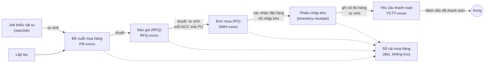
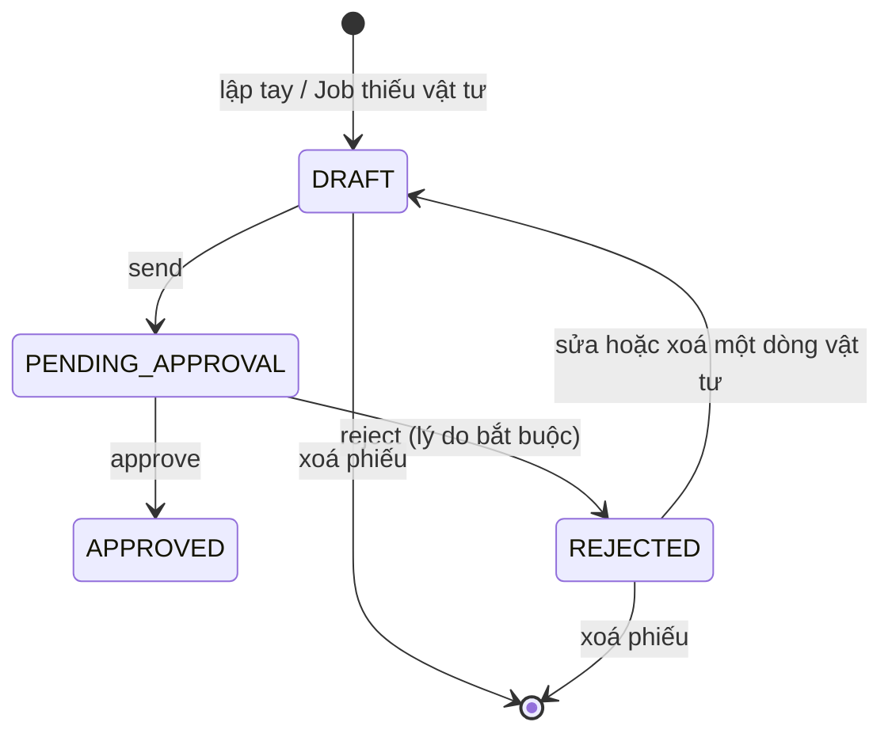
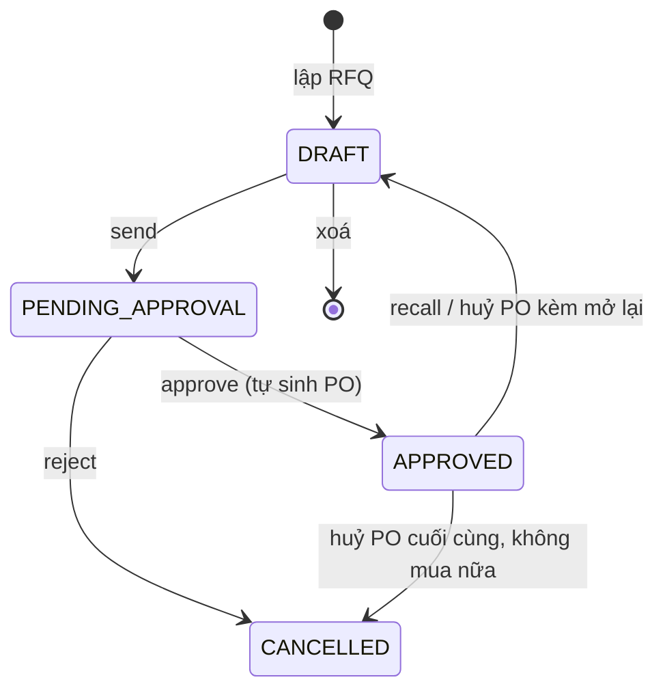
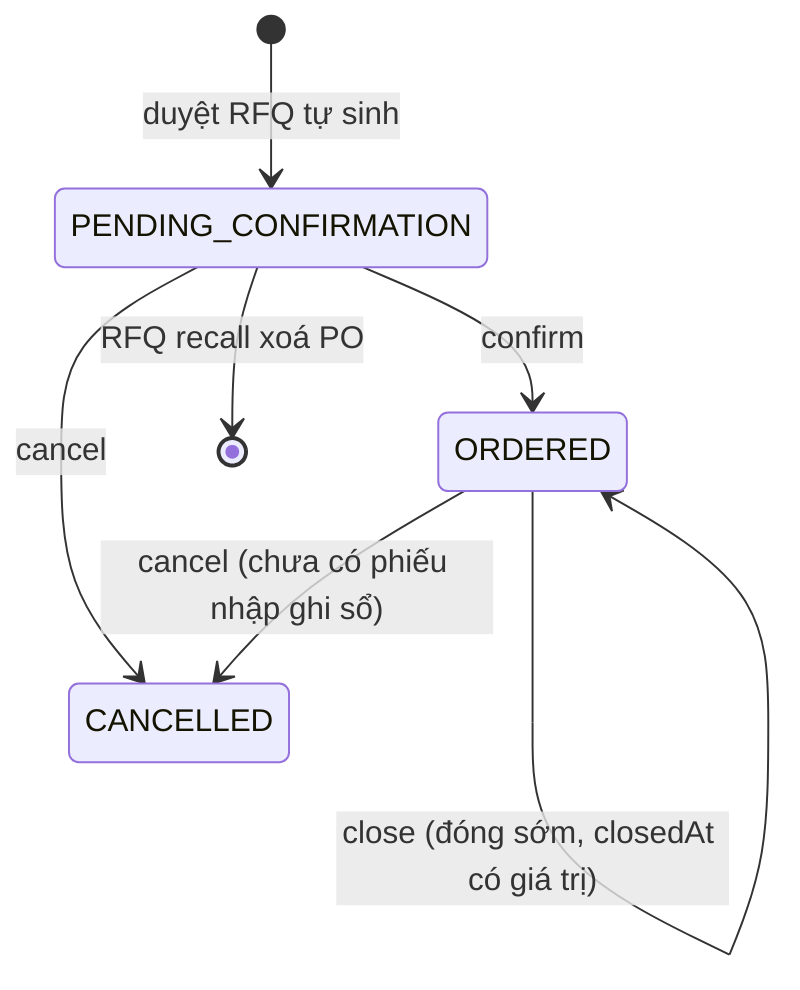
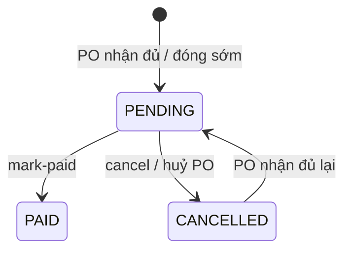

# Mua hàng: đề xuất, báo giá, đơn mua, thanh toán

Phạm vi: `src/api/` các thư mục `purchase-requests`, `purchase-quotations`, `purchase-orders`, `purchase-notes`, `purchase-ledger`, `payment-requests`. Schema ở `src/database/schemas/purchase-requests/` và `src/database/schemas/purchasing/`. Phần nhập kho (phiếu nhập, IQC, trả hàng NCC) thuộc nhóm inventory/quality, chỉ được nhắc ở đây ở chỗ nó nối vào chuỗi mua hàng. Nhà cung cấp nằm ở [partners.md](partners.md), vật tư ở [product-structure.md](product-structure.md).

## Bức tranh tổng

Một nhu cầu mua đi qua năm chứng từ. Mỗi mũi tên là một thao tác của người dùng hoặc một chứng từ **tự sinh** ra chứng từ sau.

Điểm cần nhớ:

- **Dòng đề xuất (`purchase_request_items`) là đơn vị theo dõi xuyên suốt.** Dòng báo giá, dòng đơn mua và dòng phiếu nhập đều trỏ ngược về nó. Sổ cái mua hàng đọc theo dòng này.
- PR có hai đường sinh: lập tay (`POST /purchase-requests`, luôn `DRAFT`, chỉ vật tư `DIRECT`) và tự động khi một Job thiếu vật tư (`createShortageRequest`, gọi từ `ProductionJobsService.startJob`, gắn `productionOrderId`/`productionJobId`).
- Duyệt RFQ **tự sinh PO** trạng thái `PENDING_CONFIRMATION`, mỗi NCC thắng thầu một PO. Không có route tạo PO trực tiếp.
- Ghi sổ phiếu nhập làm PO nhận đủ hàng thì **tự sinh yêu cầu thanh toán** (YCTT) trong cùng transaction (`PaymentRequestsService.createIfOrderCompleted`).
- Mã chứng từ sinh từ `document_sequences`: `PR-`, `RFQ-`, `DMH-`, `YCTT-` kèm số 5 chữ số.

Quyền: PR dùng nhóm `purchase-requests:*` (`read`, `create`, `update`, `delete`, `approve`); RFQ, PO, sổ cái và YCTT dùng chung nhóm `purchasing:*` (`read`, `create`, `update`, `delete`, `approve`).

## Đề xuất mua hàng (PR) — `/purchase-requests`

Bảng `purchase_requests` (đầu phiếu: `code`, `departmentId`, `neededDate`, `status`, thông tin gửi/duyệt/từ chối) và `purchase_request_items` (dòng vật tư: `itemId`, `quantity`, `note`, và `cancelledAt`/`cancelledBy`/`cancellationReason` khi dòng được đánh dấu **không mua**).

| Route | Quyền | Điều kiện / ghi chú |
|---|---|---|
| `GET /purchase-requests`, `GET /purchase-requests/:id` | `purchase-requests:read` | Danh sách phân trang, chi tiết. `E112` nếu không thấy. |
| `POST /purchase-requests` | `purchase-requests:create` | Lập tay, luôn `DRAFT`. Kiểm phòng ban (`E014`), không rỗng (`E146`), không trùng vật tư (`E147`), vật tư phải `DIRECT` (`E148`). |
| `DELETE /purchase-requests/:id` | `purchase-requests:delete` | Chỉ `DRAFT`/`REJECTED`, xoá luôn các dòng. |
| `POST .../send` | `purchase-requests:update` | `DRAFT → PENDING_APPROVAL`. |
| `POST .../approve` | `purchase-requests:approve` | `PENDING_APPROVAL → APPROVED`. `E116` nếu sai trạng thái. |
| `POST .../reject` | `purchase-requests:approve` | `PENDING_APPROVAL → REJECTED`, lý do bắt buộc. |
| `POST .../items` | `purchase-requests:update` | Thêm dòng vật tư vào phiếu có sẵn. Chỉ `DRAFT`/`REJECTED` (`E114`, `REJECTED` tự về `DRAFT`); cùng luật `E146`/`E147`/`E148` như lập tay, và không trùng vật tư đã có trong phiếu (`E287`). |
| `PATCH .../items/:itemId`, `DELETE .../items/:itemId` | `purchase-requests:update` | Chỉ `DRAFT`/`REJECTED` (`E114`); `REJECTED` tự về `DRAFT`. Xoá phải còn ≥ 1 dòng (`E115`). |
| `PATCH .../items/:itemId/purchasable` | `purchase-requests:update` | Đánh dấu mua/không mua một dòng, **chỉ khi PR `APPROVED`** (`E298`). Không mua bị chặn nếu dòng còn nằm trong PO chưa huỷ và chưa đóng sớm (`E125`) hoặc trong RFQ `DRAFT`/`PENDING_APPROVAL` (`E299`); đã không mua thì giữ nguyên người và thời điểm gốc. Lý do không mua ghi ở ghi chú của dòng. |
| `PATCH .../note` | `purchase-requests:update` | Sửa ghi chú chung, ở mọi trạng thái. |
| `GET .../related-notes` | `purchase-requests:read` | Gộp ghi chú của cả chuỗi (xem mục Ghi chú chuỗi). |

Chỉ dòng của PR `APPROVED` và chưa bị đánh dấu không mua mới được đưa vào báo giá. Gửi duyệt (`send`) và duyệt (`approve`) RFQ kiểm lại điều này (`E125`), để RFQ được mở lại sau khi huỷ PO không sinh PO cho dòng đã bị đánh dấu không mua.

## Báo giá (RFQ) — `/purchase-quotations`

Bảng chính: `purchase_quotations`, `purchase_quotation_items` (một dòng cho **mỗi vật tư**), `purchase_quotation_item_allocations` (phân bổ dòng vật tư báo giá về các dòng đề xuất nguồn, vì một vật tư có thể gộp nhiều dòng PR), `purchase_quotation_item_suppliers` (các NCC được hỏi giá cho vật tư đó: `unitPrice`, `leadTimeDays`, `selectedAt`/`selectedBy` khi thắng thầu) và `purchase_quotation_item_supplier_files`.

| Route | Quyền | Điều kiện / ghi chú |
|---|---|---|
| `GET /purchase-quotations`, `GET .../:id` | `purchasing:read` | Danh sách, chi tiết. `E117` nếu không thấy. |
| `GET .../:id/comparison` | `purchasing:read` | Bảng so sánh giá các NCC cho từng vật tư. |
| `POST /purchase-quotations` | `purchasing:create` | Chọn dòng PR đã duyệt, mỗi vật tư kèm NCC được hỏi giá. Lỗi: không phân bổ (`E150`), trùng dòng PR (`E128`), trùng NCC (`E129`), PR chưa duyệt hoặc dòng bị huỷ (`E125`), sai vật tư (`E149`), SL phân bổ ≤ 0 (`E265`). |
| `PATCH .../:id` | `purchasing:update` | Thay toàn bộ vật tư và NCC, chỉ khi `DRAFT`. |
| `DELETE .../:id` | `purchasing:delete` | Chỉ `DRAFT`. |
| `POST .../:id/send` | `purchasing:update` | `DRAFT → PENDING_APPROVAL`. Không có vật tư (`E131`), vật tư không có NCC (`E130`), thiếu đơn giá (`E120`). |
| `POST .../:id/approve` | `purchasing:approve` | Chọn đúng một NCC thắng cho **mỗi** vật tư (`E132` nếu thiếu/sai). Trong một transaction: đánh dấu NCC thắng, RFQ → `APPROVED`, gom các dòng theo NCC và sinh PO. |
| `POST .../:id/reject` | `purchasing:approve` | `PENDING_APPROVAL → CANCELLED`, lý do bắt buộc. |
| `POST .../:id/recall` | `purchasing:update` | `APPROVED → DRAFT`. Chặn (`E133`) nếu có PO `ORDERED`. Xoá các PO `PENDING_CONFIRMATION`, bỏ chọn NCC thắng, xoá `approvedBy`/`approvedAt`. |

Sai trạng thái ở mọi thao tác trên trả `E118`.

## Đơn mua (PO) — `/purchase-orders`

Bảng `purchase_orders` (đầu đơn: `code`, `supplierId`, `quotationId` có thể rỗng, `status`, `orderDate`, `expectedDate`, `assignedUserId`, `paymentTerm`, `vatPercent`, `otherCost`, `otherCostNote`, thông tin đặt/huỷ/đóng) và `purchase_order_items` (`purchaseRequestItemId` bắt buộc, `quotationItemSupplierId` trỏ dòng NCC thắng, `quantity`, `unitPrice`, `quantityAdjustmentReason`).

Tổng tiền PO = Σ SL × đơn giá (tiền hàng) + VAT (`vatPercent`% trên tiền hàng, làm tròn 2 số lẻ) + `otherCost`. Chỉ lưu `vatPercent`/`otherCost`/`otherCostNote` (sửa qua `PATCH /purchase-orders/:id` khi PO còn `PENDING_CONFIRMATION`); tiền VAT và tổng tiền tính lúc đọc (`purchaseOrderGrandTotalSql`, `computePurchaseOrderAmounts`), nên `totalAmount` ở danh sách và chi tiết đã gồm VAT và chi phí khác.

**Cột `status` chỉ có 3 giá trị** (`PENDING_CONFIRMATION`, `ORDERED`, `CANCELLED`). "Đang nhận hàng" và "Hoàn tất" là **tiến độ suy ra** lúc đọc (`PurchaseOrderProgress`, mục Tiến độ suy ra), không có cột nào lưu chúng. Đóng sớm cũng không có trạng thái riêng: PO vẫn `ORDERED`, đánh dấu bằng `closedAt`.

| Route | Quyền | Điều kiện / ghi chú |
|---|---|---|
| `GET /purchase-orders`, `GET .../:id` | `purchasing:read` | Chi tiết trả thêm `quotationStatus`, `canReopenQuotation`, `reopenBlockedBy`, `canClose`, `closeBlockedBy`, `closerBy`/`closedAt`/`closureReason`. `E121` nếu không thấy. |
| `PATCH .../:id` | `purchasing:update` | Sửa người phụ trách (`E136`), điều khoản thanh toán, ngày giao, ghi chú. Chỉ `PENDING_CONFIRMATION` (`E122`). |
| `PATCH .../:id/items/:itemId` | `purchasing:update` | Sửa SL, đơn giá, lý do điều chỉnh SL một dòng. Chỉ `PENDING_CONFIRMATION`. `E123` nếu dòng không thuộc PO. |
| `POST .../:id/confirm` | `purchasing:update` | `PENDING_CONFIRMATION → ORDERED`. Cần ngày giao (`E134`), điều khoản thanh toán (`E156`), mọi dòng có đơn giá (`E135`). Nếu chưa có người phụ trách thì gán người xác nhận. |
| `POST .../:id/cancel` | `purchasing:approve` | Huỷ, lý do bắt buộc, xem mục Huỷ PO. |
| `POST .../:id/close` | `purchasing:approve` | Đóng sớm PO nhận một phần, lý do bắt buộc, xem mục Đóng sớm. |
| `GET .../:id/related-notes` | `purchasing:read` | Ghi chú của cả chuỗi. |

### Huỷ PO

`POST /purchase-orders/:id/cancel`, body `{ reason, reopenQuotation? }`. Hợp lệ từ `PENDING_CONFIRMATION` lẫn `ORDERED`; đã `CANCELLED` thì `E122`; đã có phiếu nhập `POSTED` thì `E124` (hàng đã vào kho; phiếu đã ghi sổ không huỷ được nên dùng đóng sớm hoặc phiếu trả NCC). Mọi việc dưới đây chạy trong **một transaction**:

1. Huỷ yêu cầu thanh toán của PO nếu còn `PENDING`; đã `PAID` thì `E284`.
2. Huỷ các phiếu nhập `DRAFT` của PO. Phiếu ở `PENDING_RECEIPT`, `PENDING_IQC`, `IQC_COMPLETED` giữ nguyên nhưng không còn xác nhận hoặc ghi sổ được (`E145`).
3. Đổi PO sang `CANCELLED`.
4. Nếu PO sinh từ một RFQ đang `APPROVED`:
   - `reopenQuotation = true` (nhập sai giá, muốn làm lại): RFQ về `DRAFT`, bỏ chọn NCC thắng, xoá các PO `PENDING_CONFIRMATION` còn lại của RFQ (sẽ tự sinh lại khi duyệt lại). Chặn bằng `E133` nếu RFQ còn PO `ORDERED` khác.
   - Bỏ trống hoặc `false` (không mua nữa): nếu sau lần huỷ này RFQ **không còn PO nào chưa huỷ** thì RFQ cũng chuyển `CANCELLED` (lý do ghi "Huỷ đơn mua DMH-xxxxx: …"), để số lượng đã báo giá được nhả và dòng đề xuất không kẹt ở "Đang báo giá". Còn PO khác hoạt động thì RFQ giữ nguyên.

### Đóng sớm PO

Dùng khi PO nhận một phần và hàng còn lại **không về nữa**. `POST /purchase-orders/:id/close`, body `{ reason }`. Trong một transaction (khoá dòng PO):

1. PO phải `ORDERED` và chưa đóng, ngược lại `E122`.
2. Không còn phiếu nhập `DRAFT`, `PENDING_RECEIPT`, `PENDING_IQC`, `IQC_COMPLETED` của PO, ngược lại `E285`.
3. SL đã nhận từng dòng lấy từ phiếu `POSTED` đã trừ hàng trả NCC. Không có dòng nào nhận thiếu, hoặc chưa nhận gì, thì `E286` (nhận đủ thì PO đã hoàn tất; chưa nhận gì thì dùng Huỷ).
4. Dòng nhận thiếu: `quantity` hạ về số đã nhận và `quantityAdjustmentReason` ghi "Đóng sớm: đặt X, nhận Y. <lý do>". Dòng nhận 0: **xoá dòng** (khoá ngoại từ phiếu nhập là `set null`).
5. Ghi `closedBy`, `closedAt`, `closureReason`.
6. Thử sinh YCTT theo số đã nhập × đơn giá.

Vì SL dòng được hạ về số đã nhận nên mọi nơi tính theo SL đặt (tiến độ PO, tổng tiền, sổ cái) tự đúng, không cần nhánh xử lý riêng. Phần thiếu muốn mua tiếp thì lập RFQ mới từ dòng đề xuất: `quotedQuantity` của sổ cái với RFQ `APPROVED` là Σ SL các dòng PO sinh ra từ nó (RFQ nháp / chờ duyệt vẫn tính theo SL phân bổ), nên dòng PO bị hạ/xoá tự trả phần thiếu về sổ cái mà không sửa RFQ gốc; dòng đề xuất lúc này hiện "Nhập một phần".

## Phiếu nhập kho và yêu cầu thanh toán

Phiếu nhập thuộc nhóm inventory; ở đây chỉ nêu phần nối vào mua hàng. Phiếu nhập gắn PO chỉ tạo/sửa được khi PO đang `ORDERED` (`E145`), SL nhận cộng dồn các phiếu đã xác nhận không vượt SL đặt của dòng (`E154`). `confirm` và `post` kiểm lại PO còn `ORDERED`. **Phiếu đã ghi sổ (`POSTED`) không huỷ được** (`E289`): ghi sổ xong phiếu bất biến, muốn đảo hàng đã nhập thì dùng phiếu trả NCC. Huỷ phiếu chưa ghi sổ thì **huỷ luôn các phiếu IQC sinh từ phiếu** (chuyển `CANCELLED`, giữ lại để truy vết, không xác nhận hay sửa được nữa: `E288`) và các phiếu trả NCC nháp của phiếu; đã có phiếu trả NCC `POSTED` thì `E290`.

### Yêu cầu thanh toán (YCTT) — `/payment-requests`

Bảng `payment_requests`: một dòng đúng một PO (`purchaseOrderId` unique), `requestValue` là ảnh chụp tổng tiền PO (tiền hàng + VAT + chi phí khác) lúc tạo, `dueDate` = ngày đặt + kỳ hạn của PO (`IMMEDIATE` 0 ngày, `NET_15`, `NET_30`, `NET_60`). Nhật ký ở `payment_request_logs` (`CREATED`, `PAID`, `CANCELLED`).

Tự sinh khi ghi sổ một phiếu nhập làm PO **nhận đủ** (`createIfOrderCompleted`): PO phải còn `ORDERED`, có `paymentTerm`, có dòng, và SL nhận ≥ SL đặt. Khi đóng sớm PO cũng gọi hàm này. Đã có YCTT `PENDING` hoặc `PAID` thì bỏ qua; có YCTT `CANCELLED` thì **hồi sinh** bản ghi đó (về `PENDING`, cập nhật giá trị và hạn, ghi log `CREATED`).

| Route | Quyền | Ghi chú |
|---|---|---|
| `GET /payment-requests`, `GET .../export`, `GET .../:id`, `GET .../:id/logs` | `purchasing:read` | Danh sách, xuất Excel, chi tiết, nhật ký. `E157` nếu không thấy. |
| `POST .../:id/mark-paid` | `purchasing:approve` | `PENDING → PAID`. |
| `POST .../:id/cancel` | `purchasing:approve` | `PENDING → CANCELLED`, lý do bắt buộc. |

Sai trạng thái ở `mark-paid`/`cancel` trả `E158`.

**Việc chờ ở menu.** YCTT `PENDING` chính là "việc chờ" của người phụ trách thanh toán: `GET /reports/pending-approvals` trả thêm `paymentRequestsPending` = số YCTT `PENDING`, **không gate theo quyền** (cùng cách `inventoryReceiptsToPost`) — menu "Yêu cầu thanh toán" hiện số này cho mọi người vào được màn đó. Số giảm khi YCTT chuyển `PAID`/`CANCELLED`, tăng khi PO nhận đủ làm sinh (hoặc hồi sinh) YCTT; FE làm mới số này theo chu kỳ 60 giây và ngay sau mark-paid/cancel.

Cùng cách đó, menu "Trả NCC" hiện `supplierReturnsToPost` = số phiếu trả NCC `DRAFT` (tự sinh khi IQC xác nhận hàng NG cần trả — SORT/RETURN — chờ kho `post` xuất trả), không gate theo quyền; giảm khi phiếu được ghi sổ. Menu "Xuất kho" hiện `inventoryIssuesToPost` = số phiếu xuất kho `DRAFT` (tự sinh khi phiếu lãnh vật tư được duyệt, chờ kho ghi sổ xuất), cũng không gate theo quyền. Menu "IQC" hiện `iqcToInspect` = số dòng IQC `DRAFT` (kho đã gửi hàng vào kiểm, chưa nhập kết quả) + `PENDING` (FAIL chờ chọn hướng xử lý), không gate theo quyền; `IN_PROGRESS` (chờ trả NCC) là việc của Kho nên không tính.

## Tiến độ suy ra

**Tiến độ PO** (`PurchaseOrderProgress`, `PurchaseOrdersService.resolveOrderProgress`), tính từ `status`, SL đặt (Σ `quantity` các dòng) và SL nhận:

| Điều kiện | Tiến độ |
|---|---|
| `status = CANCELLED` | `CANCELLED` |
| `status = PENDING_CONFIRMATION` | `PENDING_CONFIRMATION` |
| SL đặt > 0 và nhận ≥ đặt | `COMPLETED` |
| nhận > 0 | `RECEIVING` |
| còn lại | `ORDERED` |

**SL nhận** chỉ tính phiếu nhập `POSTED`, đã trừ số hàng lỗi trả NCC (`supplier_returns` `POSTED`). Phép kiểm "vượt SL đặt" lúc nhập thì tính trên mọi phiếu đã xác nhận.

**Sổ cái mua hàng** (`GET /purchase-ledger`, `GET /purchase-ledger/export`, quyền `purchasing:read`): một dòng cho mỗi dòng đề xuất của PR `APPROVED`, trạng thái tính lúc đọc theo thứ tự ưu tiên:

| Điều kiện | `PurchaseLedgerStatus` |
|---|---|
| đã đặt ≥ SL đề xuất và nhận ≥ đã đặt | `COMPLETED` |
| đã đặt > 0 và nhận > 0 (chưa `COMPLETED`) | `RECEIVING` ("Nhập một phần") |
| đã đặt > 0 (chưa nhập gì) | `ORDERED` |
| đã báo giá > 0 | `QUOTING` |
| còn lại | `WAITING_TO_PURCHASE` |

Trong đó: *đã đặt* = Σ SL dòng của PO `ORDERED` (PO chờ xác nhận và PO huỷ không tính); *đã báo giá* = Σ SL phân bổ của RFQ **chưa `CANCELLED`** (kể cả RFQ nháp và chưa chọn NCC); *đã nhận* như trên. Bộ lọc `status` của API dùng đúng các điều kiện loại trừ nhau này (mỗi dòng chỉ thuộc một trạng thái). Hệ quả: RFQ `APPROVED` mà mọi PO của nó đã huỷ vẫn giữ dòng đề xuất ở `QUOTING`, vì vậy huỷ PO cuối cùng theo kiểu "không mua nữa" huỷ luôn RFQ.

## Ghi chú chuỗi (`purchase-notes`)

`PurchaseNotesService` chỉ **đọc gộp** trường `note` của mọi chứng từ cùng chuỗi (PR → RFQ → PO → phiếu nhập), xuất phát từ bất kỳ chứng từ nào. Không có controller riêng; các route `GET .../related-notes` của PR, RFQ, PO (và phiếu nhập) gọi vào đây.

## Cẩm nang: tình huống và cách xử lý

| Tình huống | Làm gì | Hệ quả |
|---|---|---|
| Nhập sai giá khi PO còn `PENDING_CONFIRMATION` | `PATCH /purchase-orders/:id/items/:itemId` | Sửa thẳng, không cần huỷ. |
| Nhập sai giá khi PO đã `ORDERED`, chưa nhập hàng | Huỷ PO với `reopenQuotation: true`, sửa giá ở RFQ (đang `DRAFT`), gửi duyệt và duyệt lại | PO cũ `CANCELLED` (giữ lịch sử), PO mới sinh với giá đúng. |
| Không mua nữa (chưa nhập hàng) | Huỷ PO, không bật `reopenQuotation` | RFQ cũng `CANCELLED` nếu không còn PO hoạt động; dòng đề xuất về "Chờ mua", có thể đánh dấu không mua hoặc lập RFQ mới. |
| PO nhận một phần, phần còn lại không về nữa | `POST .../close` | SL dòng hạ về số nhận, PO hoàn tất, YCTT theo số nhận; phần thiếu mua riêng bằng RFQ mới. |
| Muốn huỷ PO đã có phiếu nhập ghi sổ | Không huỷ được (`E124`, phiếu ghi sổ cũng không huỷ được) | Dùng **đóng sớm** để chốt phần đã nhập, hoặc phiếu trả NCC để đảo hàng. |
| Huỷ phiếu nhập đang chờ nhận hoặc chờ IQC | Huỷ phiếu nhập | Phiếu `CANCELLED`, các phiếu IQC của phiếu chuyển "Đã huỷ", phiếu trả NCC nháp huỷ theo; chưa chạm kho. |
| YCTT đã thanh toán mà muốn huỷ PO | Không làm được | `E284`; cần xử lý thanh toán ngoài hệ thống trước. |
| RFQ đã duyệt, muốn đổi NCC thắng | `POST .../recall` rồi duyệt lại | Chặn nếu đã có PO `ORDERED` (`E133`); khi đó huỷ các PO đó (kèm `reopenQuotation`) hoặc lập RFQ mới. |

## Ma trận hệ quả chéo

Mỗi cột là ảnh hưởng lên chứng từ đó (— là không đổi).

| Thao tác | RFQ | PO | Phiếu nhập | YCTT | Sổ cái (dòng đề xuất) |
|---|---|---|---|---|---|
| Duyệt RFQ | `APPROVED` | Sinh PO chờ xác nhận | — | — | Đã báo giá |
| Thu hồi RFQ | `DRAFT`, bỏ NCC thắng | Xoá PO chờ xác nhận | — | — | Vẫn đã báo giá |
| Huỷ PO, `reopenQuotation` | `DRAFT` | PO `CANCELLED`, xoá PO chờ khác | `DRAFT` huỷ theo | `PENDING` huỷ theo | Vẫn đã báo giá |
| Huỷ PO, không mua nữa | `CANCELLED` nếu hết PO hoạt động | PO `CANCELLED` | `DRAFT` huỷ theo | `PENDING` huỷ theo | Về "Chờ mua" nếu RFQ huỷ |
| Đóng sớm PO | — | SL hạ về số nhận, hoàn tất | Yêu cầu không còn phiếu chưa ghi sổ | Sinh theo số nhận | Đã đặt = số nhận |
| Huỷ phiếu nhập chưa ghi sổ | — | — | `CANCELLED`, IQC và phiếu trả NCC nháp huỷ theo | — | — |
| Ghi sổ phiếu làm PO đủ hàng | — | `COMPLETED` | `POSTED` | Sinh hoặc hồi sinh | `COMPLETED` |

## Ghi chú (chỗ code chưa khớp nhau, chưa sửa)

- `E249` (`POST /purchase-orders`) và `E265` ("vượt SL cần mua còn lại") còn trong `error-code.constant.ts` nhưng không có route tương ứng và `validateAllocations` chỉ chặn SL ≤ 0 (không giới hạn trên); chú thích của `purchase_quotation_item_allocations` cũng nói vậy.
- Chú thích trong `payment_requests.ts` cho rằng dòng PO bất biến sau khi `ORDERED` nên `requestValue` là ảnh chụp an toàn. Đóng sớm hạ SL dòng của PO `ORDERED`, nhưng chỉ chạy **trước khi** YCTT sinh (hoặc khi YCTT đã huỷ và được hồi sinh với giá trị tính lại), nên giá trị YCTT vẫn đúng.
- Mô tả route `PATCH /purchase-orders/:id` còn nhắc "kho nhập" dù khái niệm kho đã bỏ.
- `recallQuotation` xoá `approvedBy`/`approvedAt`, trong khi chú thích kiểu FE nói các trường này được giữ lại làm lịch sử khi thu hồi.
- Nhiều chú thích trong code trỏ tới `docs/workflows/*.md` và `docs/decisions/*.md` của bộ tài liệu cũ đã xoá; theo [README](../README.md) những file chưa có là phần chưa viết, không phải liên kết hỏng.
- Phiếu nhập `PENDING_RECEIPT`/`PENDING_IQC`/`IQC_COMPLETED` của PO bị huỷ không tự huỷ; người dùng huỷ tay.

## Bảng mã lỗi của khu vực

| Mã | HTTP | Ý nghĩa |
|---|---|---|
| E112 / E113 | 404 | Không thấy PR / dòng PR |
| E114 | 409 | PR không sửa được ở trạng thái hiện tại |
| E115 | 409 | Xoá dòng cuối của PR |
| E116 | 409 | PR sai trạng thái để duyệt/từ chối |
| E146 / E148 | 400 | PR lập tay: không có dòng nào / vật tư không phải `DIRECT` |
| E147 | 409 | PR lập tay: trùng vật tư trong cùng phiếu |
| E117 | 404 | Không thấy RFQ (`E119`, dòng RFQ, có trong danh sách mã nhưng hiện không nơi nào ném) |
| E118 | 409 | RFQ sai trạng thái cho thao tác |
| E120 | 400 | RFQ có dòng thiếu đơn giá khi gửi duyệt |
| E125 | 409 | Dòng đề xuất không mua được: PR chưa duyệt hoặc dòng đã bị đánh dấu không mua (tạo/gửi/duyệt RFQ), hoặc còn trong PO chưa huỷ và chưa đóng sớm (đánh dấu không mua) |
| E128 / E129 | 409 | RFQ: trùng dòng PR / trùng NCC trong một vật tư |
| E130 / E131 | 400 | RFQ gửi duyệt: vật tư chưa có NCC / không có vật tư |
| E132 | 409 | Duyệt RFQ: chưa chọn đúng một NCC thắng cho mỗi vật tư |
| E133 | 409 | Thu hồi RFQ hoặc huỷ PO kèm mở lại khi RFQ còn PO `ORDERED` |
| E149 | 409 | RFQ: vật tư của dòng PR khác vật tư của dòng báo giá chứa nó |
| E150 | 400 | RFQ: một vật tư không có phân bổ nào |
| E265 | 400 | RFQ: SL phân bổ không hợp lệ |
| E121 / E123 | 404 | Không thấy PO / dòng PO |
| E122 | 409 | PO sai trạng thái cho thao tác |
| E124 | 409 | Huỷ PO khi đã có phiếu nhập `POSTED` |
| E134 / E135 / E156 | 400 | Xác nhận PO thiếu ngày giao / thiếu đơn giá / thiếu điều khoản thanh toán |
| E136 | 404 | Người phụ trách PO không tồn tại |
| E145 | 400 | Nhập kho (tạo, sửa, xác nhận, ghi sổ) với PO không còn `ORDERED` |
| E154 | 400 | SL nhận vượt SL đặt của dòng PO |
| E157 | 404 | Không thấy YCTT |
| E158 | 409 | YCTT sai trạng thái cho `mark-paid`/`cancel` |
| E284 | 409 | Huỷ PO khi YCTT đã `PAID` |
| E285 | 409 | Đóng sớm PO khi còn phiếu nhập chưa ghi sổ |
| E286 | 400 | Đóng sớm PO không có gì để đóng (chưa nhận gì hoặc đã nhận đủ) |
| E288 | 409 | Xác nhận hoặc sửa phiếu IQC đã huỷ (phiếu nhập nguồn đã bị huỷ) |
| E289 | 409 | Huỷ phiếu nhập đã ghi sổ |
| E290 | 409 | Huỷ phiếu nhập khi một phiếu trả NCC của phiếu đã `POSTED` |
| E298 | 409 | Đánh dấu mua/không mua khi PR chưa `APPROVED` |
| E299 | 409 | Đánh dấu không mua khi dòng đang nằm trong RFQ nháp hoặc chờ duyệt |
