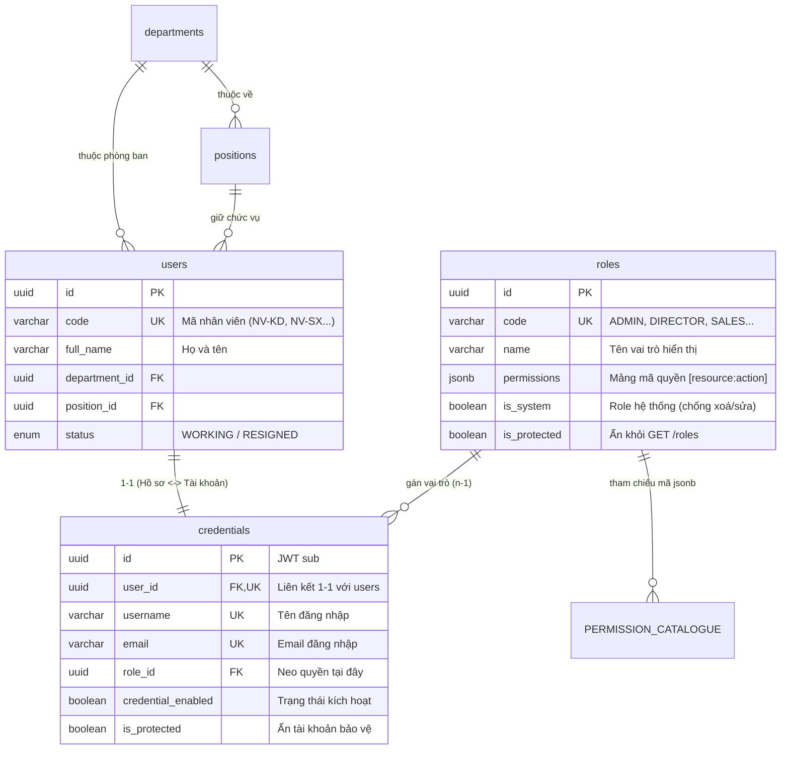

# Hướng Dẫn & Tài Liệu Phân Quyền (Roles & Permissions)

Tài liệu chi tiết về mô hình phân quyền **RBAC (Role-Based Access Control)** trong hệ thống Quản lý Sản xuất, cấu trúc dữ liệu, các vai trò mặc định, ma trận quyền và các quy tắc bảo mật.

---

## 1. Tổng quan Kiến Trúc Phân Quyền

Hệ thống áp dụng mô hình phân quyền dựa trên vai trò (RBAC) với nguyên tắc cốt lõi: **Tách biệt hoàn toàn giữa Hồ sơ nhân sự (`users`) và Tài khoản đăng nhập / Neo quyền (`credentials`)**.



### Nguyên tắc thiết kế:
1. **`users` (Con người / Nhân sự)**:
   - Lưu mã nhân viên, họ tên, phòng ban, chức vụ, trạng thái làm việc (`WORKING`, `RESIGNED`).
   - Không chứa password, không lưu role.
   - Mọi liên kết nghiệp vụ lịch sử ("ai tạo đơn", "ai duyệt lệnh SX", "ai xuất kho") đều trỏ vào `users.id`.
2. **`credentials` (Tài khoản đăng nhập)**:
   - Chứa `username`, `email`, mật khẩu đã hash và **`roleId`**.
   - Phân quyền được neo trực tiếp tại đây. Token JWT mang `sub = credentials.id` và `userId = users.id`.
3. **`roles` & `permissions`**:
   - Không có bảng `permissions` riêng trong DB. Danh mục quyền là danh sách đóng các hằng số string `resource:action` được định nghĩa trong mã nguồn (`src/constants/permission.constant.ts`).
   - Cột `roles.permissions` lưu trực tiếp mảng các mã quyền dưới dạng `jsonb`.
   - **`system:manage`**: Quyền tối cao (Super Admin), đi tắt qua mọi kiểm tra ở cả Guard và Service.
4. **Không cache quyền (Zero-stale)**:
   - Quyền không nhúng vào Access Token. Mỗi khi API được gọi, `PermissionsGuard` truy vấn trực tiếp quan hệ `credentials` $\rightarrow$ `roles` để lấy tập quyền tươi nhất tại thời điểm thực thi.

---

## 2. Các Vai Trò Mặc Định Trong Hệ Thống (Standard Roles)

Dưới đây là 7 vai trò chuẩn được thiết lập sẵn trong hệ thống (`credentials.seed.ts`):

### 2.1. ADMIN (Quản trị hệ thống)
* **Mã Role**: `ADMIN`
* **Mục đích**: Quản trị toàn bộ thông số, cấu hình kỹ thuật, tài khoản và vai trò của hệ thống.
* **Cờ đặc biệt**: `isSystem: true`, `isProtected: true` (Không thể bị sửa hay xoá bởi bất kỳ ai).
* **Quyền hạn**:
  * Sở hữu quyền tối cao: `system:manage`.
  * Toàn quyền truy cập mọi API, mọi tính năng, bypass tất cả logic kiểm tra quyền.

---

### 2.2. DIRECTOR (Ban Giám đốc)
* **Mã Role**: `DIRECTOR`
* **Mục đích**: Phê duyệt các chứng từ quan trọng, theo dõi báo cáo và kiểm soát hoạt động toàn công ty.
* **Quyền hạn chính**:
  * **Phê duyệt**: Đơn hàng (`orders:approve`), Yêu cầu mua hàng (`purchase-requests:approve`), Đơn mua hàng (`purchasing:approve`), Kế hoạch/Lệnh sản xuất (`production:approve`), Phiếu xuất hàng (`outbound:approve`), Yêu cầu xuất vật tư (`inventory-requisitions:approve`).
  * **Quản lý quyền**: Xem và phân quyền nhân sự (`roles:read`, `roles:update`, `users:create`, `users:update`).
  * **Xem toàn diện**: Xem danh mục sản phẩm, khách hàng, nhà cung cấp, tồn kho, QC và toàn bộ báo cáo doanh thu, sản xuất (`reports:read`).
* **Hạn chế**: Không trực tiếp tạo/sửa các chứng từ nghiệp vụ chi tiết của các phòng ban.

---

### 2.3. SALES (Phòng Kinh doanh)
* **Mã Role**: `SALES`
* **Mục đích**: Tìm kiếm khách hàng, lập đơn hàng bán, theo dõi tiến độ sản xuất và tạo phiếu xuất kho giao hàng.
* **Quyền hạn chính**:
  * **Khách hàng**: Toàn quyền CRUD khách hàng (`clients:read`, `clients:create`, `clients:update`, `clients:delete`).
  * **Sản phẩm & Tồn kho**: Xem danh sách sản phẩm (`items:read` - phục vụ chọn mặt hàng vào đơn) và xem tồn kho hiện tại (`inventory:read`).
  * **Đơn hàng (Orders)**: Lập đơn hàng mới, sửa, xoá đơn hàng nháp (`orders:read`, `orders:create`, `orders:update`, `orders:delete`).
  * **Theo dõi & Giao hàng**: Theo dõi tiến độ sản xuất (`production:read`), lập và quản lý phiếu xuất hàng bàn giao cho khách (`outbound:read`, `outbound:create`, `outbound:update`, `outbound:delete`).
  * **Báo cáo**: Xem báo cáo kinh doanh (`reports:read`).
* **Hạn chế**: Không có quyền tự phê duyệt đơn hàng (`orders:approve` thuộc Giám đốc).

---

### 2.4. PURCHASING (Phòng Mua hàng)
* **Mã Role**: `PURCHASING`
* **Mục đích**: Quản lý nhà cung cấp, xử lý đề xuất mua hàng (PR) và lập đơn đặt mua nguyên vật liệu (PO).
* **Quyền hạn chính**:
  * **Nhà cung cấp**: Toàn quyền CRUD nhà cung cấp (`suppliers:read`, `suppliers:create`, `suppliers:update`, `suppliers:delete`).
  * **Sản phẩm**: Tra cứu danh mục nguyên vật liệu (`items:read`).
  * **Yêu cầu mua hàng (PR)**: Tạo và cập nhật yêu cầu mua hàng (`purchase-requests:read`, `purchase-requests:create`, `purchase-requests:update`, `purchase-requests:delete`).
  * **Đơn mua hàng (PO)**: Lập và quản lý đơn đặt mua hàng (`purchasing:read`, `purchasing:create`, `purchasing:update`, `purchasing:delete`).
  * **Tra cứu liên quan**: Xem yêu cầu cấp phát vật tư (`inventory-requisitions:read`), xem báo cáo mua hàng (`reports:read`).

---

### 2.5. WAREHOUSE (Bộ phận Kho)
* **Mã Role**: `WAREHOUSE`
* **Mục đích**: Quản lý xuất - nhập - tồn kho nguyên vật liệu, bán thành phẩm và thành phẩm; cấp phát vật tư cho sản xuất.
* **Quyền hạn chính**:
  * **Kho & Vật tư**: Quản lý hàng hoá, cập nhật kho, kiểm kê (`inventory:read`, `inventory:create`, `inventory:update`, `inventory:delete`).
  * **Nhà cung cấp**: Xem thông tin nhà cung cấp phục vụ nhập kho và xuất trả NCC (`suppliers:read`).
  * **Cấp phát vật tư**: Xem và thực hiện xuất kho theo phiếu yêu cầu cấp phát (`inventory-requisitions:read`, `inventory-requisitions:issue`).
  * **Gia công ngoài & Xuất hàng**: Quản lý phiếu gửi/nhận gia công (`outsourcing:*`), hỗ trợ xuất hàng (`outbound:*`).
  * **Kiểm tra chất lượng**: Xem kết quả kiểm tra chất lượng đầu vào/đầu ra (`iqc:read`, `oqc:read`).

---

### 2.6. PRODUCTION (Phòng Sản xuất)
* **Mã Role**: `PRODUCTION`
* **Mục đích**: Quản lý cấu trúc sản phẩm (BOM), quy trình công đoạn, lập kế hoạch sản xuất, điều độ xưởng và đề xuất vật tư.
* **Quyền hạn chính**:
  * **Định mức BOM & Mặt hàng**: Quản lý BOM, sao chép BOM, tạo/sửa thông số sản phẩm (`items:bom-manage`, `items:copy`, `items:read`, `items:create`, `items:update`, `items:delete`).
  * **Công đoạn (Operations)**: Quản lý danh mục công đoạn sản xuất (`operations:read`, `operations:create`, `operations:update`, `operations:delete`).
  * **Lệnh & Kế hoạch SX**: Theo dõi tiến độ và cập nhật số lượng lệnh sản xuất (`production:read`, `production:update`).
  * **Đơn hàng (Orders)**: Xem thông tin đơn hàng (`orders:read`).
  * **Yêu cầu vật tư**: Tạo đề xuất cấp phát vật tư sản xuất (`inventory-requisitions:create`, `inventory-requisitions:update`, `inventory-requisitions:delete`).
  * **Gia công ngoài & OQC**: Quản lý các công đoạn thuê ngoài (`outsourcing:*`), lập phiếu kiểm tra chất lượng thành phẩm (`oqc:create`).
* **Hạn chế**: Không có quyền duyệt lệnh sản xuất (`production:approve` thuộc Ban Giám đốc).

---

### 2.7. QC (Phòng Quản lý chất lượng)
* **Mã Role**: `QC`
* **Mục đích**: Kiểm tra chất lượng nguyên vật liệu đầu vào (IQC), thành phẩm xuất xưởng (OQC) và quản lý bộ tiêu chuẩn AQL.
* **Quyền hạn chính**:
  * **IQC (Đầu vào)**: Toàn quyền lập biên bản kiểm tra vật tư mua về (`iqc:read`, `iqc:create`, `iqc:update`, `iqc:delete`).
  * **OQC (Thành phẩm)**: Kiểm tra và đánh giá chất lượng lô hàng sản xuất xong (`oqc:read`, `oqc:update`).
  * **Tiêu chuẩn AQL**: Thiết lập và quản lý bảng tiêu chuẩn lấy mẫu kiểm nghiệm (`qc-aql:read`, `qc-aql:create`, `qc-aql:update`).
  * **Tra cứu**: Xem danh mục sản phẩm (`items:read`), xem tiến độ gia công ngoài (`outsourcing:read`), xem báo cáo lỗi chất lượng (`reports:read`).

---

## 3. Ma Trận Phân Quyền Chi Tiết (Role - Permission Matrix)

| Module | Phân nhóm quyền | ADMIN | DIRECTOR | SALES | PURCHASING | WAREHOUSE | PRODUCTION | QC |
| :--- | :--- | :---: | :---: | :---: | :---: | :---: | :---: | :---: |
| **System** | `system:manage` | **✓** | - | - | - | - | - | - |
| **Phân quyền** | `roles:read`, `roles:update` | **✓** | **✓** | - | - | - | - | - |
| | `roles:create`, `roles:delete` | **✓** | - | - | - | - | - | - |
| **Nhân sự** | `users:create`, `users:update` | **✓** | **✓** | - | - | - | - | - |
| **Khách hàng** | `clients:read` | **✓** | **✓** | **✓** | - | - | - | - |
| | `clients:create`, `clients:update`, `clients:delete` | **✓** | - | **✓** | - | - | - | - |
| **Sản phẩm (Items)** | `items:read` | **✓** | **✓** | **✓** | **✓** | **✓** | **✓** | **✓** |
| | `items:create`, `items:update` | **✓** | - | - | - | **✓** | **✓** | - |
| | `items:delete`, `items:copy` | **✓** | - | - | - | - | **✓** | - |
| | `items:bom-manage` | **✓** | - | - | - | - | **✓** | - |
| **Công đoạn SX** | `operations:*` (CRUD) | **✓** | - | - | - | - | **✓** | - |
| **Nhà cung cấp** | `suppliers:read` | **✓** | **✓** | - | **✓** | **✓** | - | - |
| | `suppliers:create`, `update`, `delete` | **✓** | - | - | **✓** | - | - | - |
| **Đơn hàng (Orders)**| `orders:read` | **✓** | **✓** | **✓** | - | - | **✓** | - |
| | `orders:create`, `orders:update`, `orders:delete` | **✓** | - | **✓** | - | - | - | - |
| | `orders:approve` | **✓** | **✓** | - | - | - | - | - |
| **Yêu cầu mua (PR)** | `purchase-requests:read` | **✓** | **✓** | - | **✓** | **✓** | **✓** | - |
| | `purchase-requests:create`, `update`, `delete` | **✓** | - | - | **✓** | - | - | - |
| | `purchase-requests:approve` | **✓** | **✓** | - | - | - | - | - |
| **Đơn mua hàng (PO)**| `purchasing:read` | **✓** | **✓** | - | **✓** | **✓** | - | - |
| | `purchasing:create`, `update`, `delete` | **✓** | - | - | **✓** | - | - | - |
| | `purchasing:approve` | **✓** | **✓** | - | - | - | - | - |
| **Tồn kho & Phiếu kho**| `inventory:read` | **✓** | **✓** | **✓** | - | **✓** | **✓** | - |
| | `inventory:create`, `update`, `delete` | **✓** | - | - | - | **✓** | - | - |
| **Yêu cầu xuất vật tư**| `inventory-requisitions:read` | **✓** | **✓** | - | **✓** | **✓** | **✓** | - |
| | `inventory-requisitions:create`, `update`, `delete` | **✓** | - | - | - | - | **✓** | - |
| | `inventory-requisitions:approve` | **✓** | **✓** | - | - | - | - | - |
| | `inventory-requisitions:issue` (Thực xuất) | **✓** | - | - | - | **✓** | - | - |
| **Sản xuất (Lệnh SX)** | `production:read` | **✓** | **✓** | **✓** | - | - | **✓** | - |
| | `production:update` | **✓** | - | - | - | - | **✓** | - |
| | `production:approve` | **✓** | **✓** | - | - | - | - | - |
| **Gia công ngoài** | `outsourcing:read` | **✓** | **✓** | - | - | **✓** | **✓** | **✓** |
| | `outsourcing:create`, `update`, `delete` | **✓** | - | - | - | **✓** | **✓** | - |
| **Kiểm tra IQC** | `iqc:read` | **✓** | **✓** | - | - | **✓** | - | **✓** |
| | `iqc:create`, `iqc:update`, `iqc:delete` | **✓** | - | - | - | - | - | **✓** |
| **Kiểm tra OQC** | `oqc:read` | **✓** | **✓** | - | - | **✓** | **✓** | **✓** |
| | `oqc:create` | **✓** | - | - | - | - | **✓** | - |
| | `oqc:update`, `oqc:delete` | **✓** | - | - | - | - | - | **✓** |
| **Tiêu chuẩn QC AQL**| `qc-aql:*` (CRUD) | **✓** | **✓** | - | - | - | - | **✓** |
| **Xuất hàng (Outbound)**| `outbound:read` | **✓** | **✓** | **✓** | - | **✓** | - | - |
| | `outbound:create`, `update`, `delete` | **✓** | - | **✓** | - | **✓** | - | - |
| | `outbound:approve` | **✓** | **✓** | - | - | - | - | - |
| **Báo cáo tổng hợp** | `reports:read` | **✓** | **✓** | **✓** | **✓** | **✓** | **✓** | **✓** |

---

## 4. Các Quy Tắc An Toàn & Bảo Mật Nghiệp Vụ

1. **Chống leo thang đặc quyền (Privilege Escalation - `E034`)**:
   - Một người dùng chỉ có thể gán quyền `system:manage` cho role khác nếu chính người dùng đó đang sở hữu quyền `system:manage`.
2. **Bảo vệ vai trò hệ thống (`isSystem`)**:
   - Các vai trò có `isSystem: true` (như `ADMIN`) bị cấm sửa đổi tên, quyền hoặc xóa thông qua API (`E030`).
3. **Bảo vệ toàn vẹn dữ liệu khi xoá Role (`E029`)**:
   - Không thể xoá bất kỳ Role nào nếu đang còn tài khoản (`credentials`) tham chiếu tới Role đó.
4. **Cơ chế khoá tài khoản 2 lớp**:
   - Nhân viên nghỉ việc: Đặt `users.status = RESIGNED` $\rightarrow$ Chặn đăng nhập / refresh (`E018`).
   - Khoá khẩn cấp tài khoản: Đặt `credentials.credentialEnabled = false` $\rightarrow$ Chặn đăng nhập ngay lập tức độc lập với trạng thái hồ sơ nhân sự.
5. **Quy tắc kiểm tra `@Permissions`**:
   - Nếu route không khai báo `@Permissions(...)`: Chỉ cần đăng nhập hợp lệ (JWT valid) là được phép truy cập.
   - Nếu route khai báo nhiều mã quyền `@Permissions('a', 'b')`: Người dùng bắt buộc phải sở hữu **đầy đủ tất cả** các mã quyền được liệt kê (phép toán `AND`).

---

## 5. API Endpoints Quản Lý Phân Quyền

| Phương thức | Đường dẫn | Quyền yêu cầu | Mô tả |
| :--- | :--- | :--- | :--- |
| `GET` | `/roles` | `roles:read` | Lấy danh sách các vai trò (tự động ẩn các role `isProtected`) |
| `GET` | `/roles/:roleId` | `roles:read` | Xem chi tiết vai trò và danh sách permission đính kèm |
| `POST` | `/roles` | `roles:create` | Tạo mới một vai trò tuỳ chỉnh |
| `PATCH` | `/roles/:roleId` | `roles:update` | Chỉnh sửa tên, mô tả hoặc danh sách permissions của role |
| `DELETE` | `/roles/:roleId` | `roles:delete` | Xoá vai trò (nếu không phải system và không có user gắn vào) |
| `GET` | `/roles/catalogue` | `roles:read` | Lấy danh mục toàn bộ mã quyền khả dụng trong hệ thống |
| `PATCH` | `/users/:userId/role`| `roles:update` | Gán vai trò cho một tài khoản người dùng |
| `GET` | `/users/me/permissions`| Đã đăng nhập | Lấy danh sách quyền hiệu lực của chính người dùng hiện tại |

---

## 6. Hướng Dẫn Đồng Bộ Quyền Khi Thêm Tính Năng Mới

Khi phát triển một phân hệ mới hoặc thêm quyền mới vào hệ thống:

1. **Bước 1: Khai báo mã quyền**:
   Thêm mã quyền dạng `resource:action` vào mảng `PERMISSION_CODES` tại [`src/constants/permission.constant.ts`](file:///home/workspace/2605-quanlysanxuat/be-quanlysanxuat/src/constants/permission.constant.ts).
2. **Bước 2: Gắn Decorator lên Controller**:
   ```typescript
   @Post()
   @Permissions('resource:create')
   async createResource(...) { ... }
   ```
3. **Bước 3: Gán quyền cho các Role mặc định**:
   Bổ sung mã quyền vào mảng `permissions` của các Role tương ứng trong [`src/database/seeds/credentials.seed.ts`](file:///home/workspace/2605-quanlysanxuat/be-quanlysanxuat/src/database/seeds/credentials.seed.ts).
4. **Bước 4: Chạy đồng bộ Database**:
   * **Môi trường Development**:
     ```bash
     pnpm db:seed:credentials
     ```
   * **Môi trường Production**:
     ```bash
     NODE_ENV=production pnpm db:seed:credentials
     ```
   *Hàm `ensureRole()` sẽ tự động so sánh và cập nhật các quyền mới vào cơ sở dữ liệu mà không làm gián đoạn hay ảnh hưởng đến dữ liệu sẵn có.*
